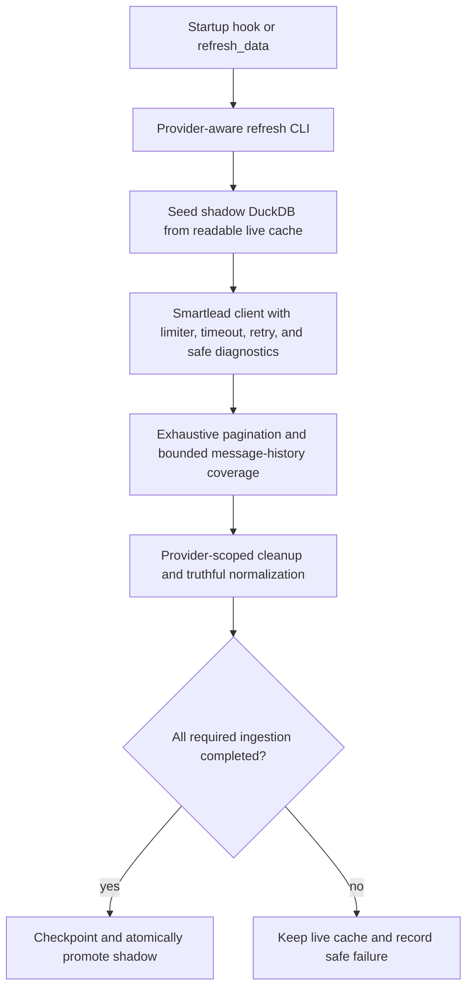

> Scope update (2026-07-11): Brandon explicitly added read-only Smart Delivery support after this plan was completed. SENDOSS-98 and `2026-07-11-sendoss-98-smart-delivery-read-parity.md` supersede this plan's Smart Delivery exclusion; all mutation exclusions remain in force.

# Smartlead Read-Only Parity Hardening - Plan

## Goal Capsule

- **Objective:** Make Smartlead V1 safe, complete, and truthful across API ingestion, DuckDB snapshots, MCP surfaces, startup hooks, and built host bundles.
- **Source order:** Repo `AGENTS.md` and SENDOSS-97 override this plan; `docs/SMARTLEAD_PROVIDER_CONTRACT.md` defines provider semantics; current official Smartlead documentation defines the external contract.
- **Execution profile:** Preserve Instantly behavior and demo mode, use synthetic fixtures only, and fail closed when completeness or privacy cannot be proven.
- **Stop conditions:** Do not add provider mutations, expose sensitive values or customer data, claim live-shape validation, merge the PR, release, or retarget away from `codex/smartlead-api-parity-map`.
- **Tail ownership:** Open a release-ready PR for SENDOSS-97 against `codex/smartlead-api-parity-map`, add `ai:autofix-enabled`, and wait for coordinator confirmation.

---

## Product Contract

### Summary

The integrated Smartlead provider covers the intended read-only surfaces but still contains contract, privacy, completeness, and host-lifecycle gaps. This work reconciles every refresh event with the current official API without widening V1 into mutation or support-gated Smart Delivery access.

### Problem Frame

Current code exceeds one documented page limit, lacks general request timeouts, can silently stop pagination at local caps, retains forbidden mailbox connection fields in local raw JSON, misses current campaign field names, infers unique metrics from non-unique counts, and disables Smartlead startup refresh in generated host bundles.

### Requirements

**External API correctness**

- R1. Every Smartlead endpoint called by refresh must match its documented method, path, query names, page limits, and response wrappers.
- R2. List ingestion must either exhaust pagination or fail the shadow refresh with an explicit bounded-cap error.
- R3. Each request must have a 30-second network timeout, bounded transient retries, and cancellation-aware waits that release all permits.
- R4. The default limiter must remain conservative for the documented Standard tier and shared per-key limit while honoring provider retry signals.

**Privacy and mapping truthfulness**

- R5. Sensitive query values, lead emails, mailbox connection details, signatures, reply-to/BCC values, and raw provider error bodies must not appear in diagnostics or account raw JSON.
- R6. Campaign configuration must map current Smartlead names for daily limit, text mode, ESP matching, stop-on-reply, schedule timezone, tracking, and timestamps.
- R7. Unique metrics may be populated only from distinct lead evidence or explicit unique-count fields.
- R8. Range analytics, step statistics, mailbox daily rows, bounded message history, and support-gated Smart Delivery must retain partial or unsupported coverage labels.

**Snapshot and host lifecycle**

- R9. A full Smartlead refresh must remove stale Smartlead rows while preserving other providers in the same workspace.
- R10. A campaign-scoped Smartlead refresh must replace selected evidence while preserving provider-wide account rollups and unselected campaigns.
- R11. A failed Smartlead refresh must leave the live DuckDB snapshot untouched.
- R12. Smartlead-only and all-provider startup hooks with at least one configured provider must launch the same atomic background refresh used by manual `refresh_data`.
- R13. Codex and Claude Code generated bundles must carry the updated runtime and provider-safe behavior without changing MCP tool contracts.

**Release evidence**

- R14. Durable source receipts, regression results, full validation, host bundle proof, independent review, and residual live-key risk must be recorded before closeout.
- R15. The PR must target `codex/smartlead-api-parity-map`, remain read-only, carry SENDOSS-97 and `ai:autofix-enabled`, and stay unmerged pending coordination.

### Scope Boundaries

In scope: current Smartlead refresh endpoints, transport controls, normalizers, provider-preserving cleanup, automatic startup refresh, generated host parity, documentation, and synthetic regression evidence.

Out of scope: campaign, lead, account, email, webhook, or settings mutations; live customer probes; support-gated Smart Delivery onboarding; lead-list ingestion; new MCP tools; releases; and merging the parity base into `main`.

### Acceptance Examples

- AE1. Mailbox-statistics pages use `limit <= 20`, and a remaining page after the configured cap fails rather than publishing partial rows. Covers R1-R2.
- AE2. A provider error that echoes a sensitive value and lead email exposes only status, path, query-key names, and a safe error code. Covers R5.
- AE3. A campaign using current Smartlead setting names populates the normalized campaign row exactly. Covers R6.
- AE4. Aggregate reply totals do not become unique replies; exhaustive lead reply flags provide the distinct count. Covers R7.
- AE5. A full Smartlead refresh removes stale Smartlead rows and preserves Instantly rows. Covers R9.
- AE6. A scoped Smartlead refresh replaces selected evidence while preserving other Smartlead campaigns and account rollups. Covers R10.
- AE7. A Smartlead failure after shadow work begins leaves the prior live cache readable. Covers R11.
- AE8. Smartlead-only startup with a configured provider launches the generic refresh CLI in generated Codex and Claude Code bundles. Covers R12-R13.

---

## Planning Contract

### Key Technical Decisions

- KTD1. Fail closed on pagination safety caps because partial data must not be presented as complete.
- KTD2. Apply the 30-second timeout to network fetch execution, not proactive limiter waits.
- KTD3. Preserve only an allowlisted account metadata projection in `source_raw_json` because a denylist is brittle against SMTP, IMAP, signature, BCC, and reply-to fields.
- KTD4. Derive unique replies from exhaustive lead-level flags when the aggregate endpoint lacks an explicit unique count.
- KTD5. Keep Smart Delivery unsupported for V1 because its official read surfaces use a separate support-gated host and access model.
- KTD6. Reuse `refreshWorkspaceAtomically` for automatic Smartlead refresh rather than adding another refresh implementation.
- KTD7. Make provider-specific cleanup explicit for mixed workspaces while retaining all-provider demo reset behavior.

### High-Level Technical Design

### Source Receipts

The official snapshot was fetched on 2026-07-11 from `https://api.smartlead.ai/llms-full.txt`. Its SHA-256 is `ab4c1a1bc65f3331b9d813f8509c67ca3b3014d80e4954e5d34fe7a6fe164a2b`; the raw snapshot remains excluded from version control.

| Refresh surface | Official source | Audit decision |
|---|---|---|
| Campaign directory | `https://api.smartlead.ai/api-reference/campaigns/get-all` | Direct array or common wrapper; no documented pagination. |
| Campaign detail | `https://api.smartlead.ai/api-reference/campaigns/get-by-id` | Accept direct or `data` wrapper; map current names. |
| Sequences | `https://api.smartlead.ai/api-reference/campaigns/get-sequences` | Accept wrapped array; map variants and nested delay. |
| Campaign analytics | `https://api.smartlead.ai/api-reference/campaigns/get-analytics` | Store raw totals and derive distinct replies from leads. |
| Campaign range analytics | `https://api.smartlead.ai/api-reference/campaigns/get-analytics-by-date` | Do not invent daily rows. |
| Step statistics | `https://api.smartlead.ai/api-reference/campaigns/statistics` | Max 1000; accept aggregate or detail arrays. |
| Mailbox statistics | `https://api.smartlead.ai/api-reference/campaign-statistics/mailbox-statistics` | Max 20; require date-bearing rows. |
| Campaign accounts | `https://api.smartlead.ai/api-reference/campaigns/get-email-accounts` | Accept direct or wrapped array; store safe assignments. |
| Workspace accounts | `https://api.smartlead.ai/api-reference/email-accounts/get-all` | Max 100; exhaust pages; persist allowlisted metadata. |
| Warmup stats | `https://api.smartlead.ai/api-reference/email-accounts/warmup-stats` | Last seven days; do not relabel as campaign sends. |
| Campaign leads | `https://api.smartlead.ai/api-reference/campaigns/get-leads` | Max 100; exhaust pages; categories remain evidence. |
| Single message history | `https://api.smartlead.ai/api-reference/campaigns/get-lead-history` | Optional bodies; bounded fallback. |
| Bulk message history | `https://api.smartlead.ai/api-reference/campaigns/get-leads-history-bulk` | Read-equivalent POST with documented suffix. |
| Error handling | `https://api.smartlead.ai/guides/error-handling` | 30-second timeout and transient retries. |
| Rate limiting | `https://api.smartlead.ai/guides/rate-limits` | Shared per-key limits; conservative 50/min default. |
| Global analytics | `https://api.smartlead.ai/api-reference/analytics/overview` | Client-only; not normalized by refresh. |
| Campaign performance | `https://api.smartlead.ai/api-reference/analytics/campaign-performance` | Client-only; do not claim coverage. |
| Provider performance | `https://api.smartlead.ai/api-reference/analytics/provider-performance` | Client-only; do not claim coverage. |
| Smart Delivery | `https://api.smartlead.ai/api-reference/smart-delivery/list-tests` | Separate support-gated host; unsupported in V1. |

### Sequencing

Transport and privacy hardening land first. Mapping and cleanup follow with database regressions. Startup hooks then reuse the hardened atomic path. Documentation and QA evidence finalize after validation and independent review.

---

## Implementation Units

### U1. Harden Smartlead transport and pagination

- **Goal:** Bound requests, honor current limits, prevent silent truncation, and remove customer data from diagnostics.
- **Requirements:** R1-R5.
- **Dependencies:** None.
- **Files:** `plugin/smartlead-client.ts`, `plugin/smartlead-ingest.ts`, `scripts/test-smartlead-client.mjs`, `scripts/test-smartlead-ingest.mjs`.
- **Approach:** Add a default network timeout, documented transient retries, safe query-key/error summaries, cap-exhaustion errors, and mailbox limit 20.
- **Test scenarios:** A hung fetch times out once; caller cancellation does not retry; 429 honors provider signals; 502 retries; provider errors expose no sensitive value/email/body; cap exhaustion throws; mailbox pages use limit 20; normal pagination still exhausts.
- **Verification:** Focused client and ingest tests prove each transport boundary without network access.

### U2. Correct Smartlead mappings and raw-account privacy

- **Goal:** Normalize only documented fields and counts while retaining useful safe metadata.
- **Requirements:** R5-R8.
- **Dependencies:** U1.
- **Files:** `plugin/smartlead-ingest.ts`, `scripts/test-smartlead-ingest.mjs`, `scripts/fixtures/smartlead-client/*`, `docs/SMARTLEAD_PROVIDER_CONTRACT.md`, `docs/SMARTLEAD_API_PARITY_MAP.md`.
- **Approach:** Add current aliases, nested timezone/delay mapping, allowlisted account raw JSON, distinct-lead reply derivation, and nullable unique metrics when unavailable.
- **Execution note:** Strengthen synthetic fixtures from the source receipt before changing mapping assertions.
- **Test scenarios:** Current campaign fields populate normalized columns; account raw JSON omits connection/signature/BCC/reply-to fields; total counts do not populate unique fields; lead flags produce distinct replies; range objects produce no invented daily rows; capabilities remain truthful.
- **Verification:** Smartlead ingest and provider workspace-view tests show truthful counts and no sensitive raw fields.

### U3. Prove provider-safe cleanup and atomic snapshots

- **Goal:** Guarantee stale-row deletion, scoped preservation, mixed-provider safety, and live-cache survival on failure.
- **Requirements:** R9-R11.
- **Dependencies:** U1-U2.
- **Files:** `plugin/local-db.ts`, `plugin/instantly-ingest.ts`, `plugin/smartlead-ingest.ts`, `scripts/test-smartlead-ingest.mjs`, `scripts/test-cache-identity.mjs`.
- **Approach:** Add provider-qualified cleanup for provider refreshes, expand full/scoped Smartlead regressions, and exercise shadow promotion with a failing Smartlead client.
- **Test scenarios:** Full Smartlead refresh removes stale Smartlead rows and preserves Instantly; scoped refresh preserves other Smartlead campaigns and account totals; Instantly-only refresh preserves Smartlead rows; failed shadow refresh leaves live rows unchanged; successful promotion cleans shadow files.
- **Verification:** Database assertions prove provider isolation and atomic behavior.

### U4. Enable Smartlead automatic refresh in every host bundle

- **Goal:** Make automatic snapshots provider-aware for Smartlead-only and all-provider startup.
- **Requirements:** R12-R13.
- **Dependencies:** U1-U3.
- **Files:** `scripts/`, `plugin/refresh-cli.ts`, `plugin/refresh-status.ts`, `scripts/test-provider-config-setup-doctor.mjs`, `scripts/test-host-bundle-inventory.mjs`, `README.md`, `docs/INSTALL.md`, `docs/TROUBLESHOOTING.md`, `docs/TRUST_AND_PRIVACY.md`.
- **Approach:** Replace the Instantly-only gate with configured-provider detection, retain actionable missing-provider status, and verify generated Claude Code/Codex assets carry the provider-aware hook.
- **Execution note:** Use deterministic fake-runtime hook proof rather than live provider access.
- **Test scenarios:** Smartlead configuration launches refresh CLI; all mode with either provider launches; all mode with none stays idle; missing Smartlead configuration never asks for Instantly; sensitive values stay out of output; generated Codex and Claude Code bundles carry the hook.
- **Verification:** Provider-config smoke tests and host-bundle inventory validate source and generated artifacts.

### U5. Close audit, validation, review, and PR evidence

- **Goal:** Produce durable proof and a release-ready unmerged PR.
- **Requirements:** R14-R15.
- **Dependencies:** U1-U4.
- **Files:** `docs/orchid/qa/2026-07-11-sendoss-97-smartlead-parity-evidence.md`, `docs/SMARTLEAD_PROVIDER_CONTRACT.md`, `docs/SMARTLEAD_API_PARITY_MAP.md`, `docs/MCP_RESPONSE_CONTRACT.md` when wording changes are required.
- **Approach:** Record endpoint receipts, validation, no-live-key risk, and independent review disposition; update Linear and PR with public-safe evidence.
- **Test scenarios:** Documentation contains no sensitive example or customer data; Smart Delivery language is truthful; PR base is the parity branch; release and merge remain untouched.
- **Verification:** Full validation passes, independent review has no unresolved P0-P2 blocker, and GitHub/Linear state matches closeout.

---

## Verification Contract

| Gate | Commands or evidence | Done signal |
|---|---|---|
| Focused transport | `npm run test:smartlead-client` | Timeout, retry, redaction, page sizes, and cap failure pass. |
| Focused normalization | `npm run test:smartlead-ingest` and `npm run test:provider-workspace-views` | Mappings, unique semantics, stale deletion, scoped preservation, and capabilities pass. |
| Atomic/provider orchestration | `npm run --silent build:plugin && node scripts/test-cache-identity.mjs` | Mixed-provider cleanup and failed-shadow preservation pass. |
| Startup and MCP smoke | `npm run test:provider-config` and `npm run test:plugin:smoke` | Smartlead/all startup and existing contracts pass. |
| Full plugin | `npm run test:plugin`, `npm run validate:plugin`, and `npm run lint:plugin` | Full relevant plugin tier passes. |
| Host bundles | `npm run test:host-bundles` | Claude Code, Codex, Cursor, and OpenCode bundles build and inventory correctly. |
| Repo hygiene | Orchid repo preflight and `git diff --check` | No preflight failures or whitespace errors. |
| Independent review | Independent subagent review against this plan and SENDOSS-97 | No unresolved P0-P2 blocker; accepted findings are revalidated. |

Live Smartlead access is not a gate because no provider access is assumed. The QA artifact must state that official-doc and synthetic-fixture validation does not prove workspace-specific live shapes.

---

## Definition of Done

- Every requirement R1-R15 is implemented or evidenced as an unchanged truthful boundary.
- Every endpoint used by Smartlead refresh has a dated official receipt and tested handling.
- Focused, full plugin, host bundle, lint, validation, preflight, and diff checks pass.
- No sensitive value, mailbox connection field, raw provider error, live customer row, or raw official-doc snapshot is tracked.
- Independent review is resolved and recorded in the QA artifact.
- Linear SENDOSS-97 and parent SENDOSS-69 identify the plan, validation, PR, residual live-key risk, and next action.
- A release-ready PR targets `codex/smartlead-api-parity-map`, carries `ai:autofix-enabled`, and remains unmerged and unreleased pending coordinator confirmation.
- Dead-end experiments and temporary code are absent from the final diff.
