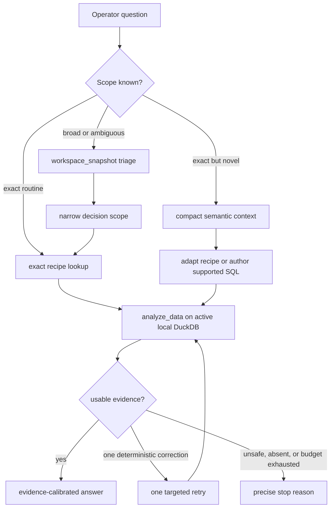

# SendLens Local Agentic Analytics Routing - Program Plan

## Goal Capsule

| Field | Contract |
| --- | --- |
| Objective | Make routine SendLens analysis faster and less error-prone by routing exact questions to the existing saved-query library, giving agents compact semantic context, and retaining focused read-only SQL as a fallback. |
| Product shape | This is an additive routing and teaching layer around the current local plugin, not a query-engine overhaul and not SendLens Cloud. |
| First routing release | After the independent U0 safety fix lands, ship the exact campaign-tag sender-risk route. It must not wait for schema migrations, a universal semantic registry, executor interruption, or other DuckDB backlog work. |
| Execution profile | One local SendLens plugin, one active DuckDB cache, the existing MCP boundary, and separate Linear issue, branch, worktree, PR, and validation ownership for each independently releasable unit. |
| Stop conditions | Stop if a unit requires Cloud infrastructure, a second analytical database, provider mutation, direct database-file access by the agent, a workflow-planning MCP tool, or unrelated runtime ownership from SENDOSS-101 or SENDOSS-102. |
| Tail ownership | Each implementation issue owns its focused regression fixture, relevant plugin gates, host-bundle proof when agent context changes, version bump, PR, Linear closeout, and branch cleanup. |

---

## Product Contract

### Summary

SendLens already has the right base architecture: 58 saved SQL recipes in `plugin/query-recipes.ts`, the `analysis_starters` tool that exposes them, public DuckDB views, schema-discovery tools, and guarded `analyze_data` execution against one local cache.

The primary gap is routing and context delivery. Agents can write SQL, but they are not consistently told which saved query is the golden path, what each field means, or when a broad workspace scan is inappropriate. The right architecture is recipes first, progressively deeper semantic context when the route is unclear, and focused read-only SQL as a fallback. Deep executor work remains under its existing runtime owners instead of blocking the routing win.

### Problem Frame

The sanitized seed incident demonstrates a routing failure, not a missing-data-platform failure. An exact campaign-tag sender-risk question expanded into a workspace scan, multiple schema and placement-table inspections, a filter against the assignment account tag instead of the campaign tag, and redundant 30-day recomputation from daily rows. The existing `campaign-sender-inventory-by-tag` recipe already joins campaign IDs through `campaign_tags` and reads precomputed fields from `campaign_accounts`.

Analogous repository evidence shows that `INSTRUCTIONS.md` and analyst guidance disagree on broad-first behavior, combined tag/sender/deliverability concepts are scored independently, starter summaries omit decision-critical semantics, catalog search discovers columns one surface at a time, and `list_columns` does not first enforce the public allowlist. A separate confirmed safety defect exists in `analyze_data`: its outer failure response can echo submitted or rewritten SQL.

### Architecture Decision

This is an addition with staged cleanup, not an overhaul:

- Saved recipes remain trusted golden paths and SQL examples.
- The agent may adapt a recipe or write focused read-only SQL against the same local DuckDB when no exact recipe fits.
- The first release changes routing, the canonical recipe, and focused tests only.
- Semantic metadata, public aliases, catalog performance, and diagnostics ship as independent later units.
- Typed bindings and deep runtime claims stay behind their existing activation gates and Linear owners.

### Actors

- A1. The operator asks a SendLens business question and expects a fast, evidence-calibrated answer without knowing schemas or recipe IDs.
- A2. The host coordinator or public skill resolves scope, chooses an evidence lane, and owns the final answer.
- A3. An analyst or focused specialist uses the same semantic context and local query boundary whether it runs as a native subagent or inline.
- A4. The SendLens MCP runtime supplies deterministic catalog context, guarded local SQL execution, readiness, and privacy-safe evidence receipts.
- A5. A maintainer mines new papercuts, adds sanitized evidence, and promotes repeated failures into implementation work.

### Requirements

**Routing and saved-query use**

- R1. Exact campaign or campaign-tag questions, optionally provider-qualified, plus a known focused routine must bypass `workspace_snapshot` and speculative schema discovery. Provider-only or workspace-wide routine requests remain broad and follow F4.
- R2. The normal exact path uses at most two tool calls: one exact recipe lookup and one focused execution.
- R3. The first routing release reuses and enriches `campaign-sender-inventory-by-tag`. It joins through `campaign_tags`, provider-qualifies campaign identity, includes only campaigns whose normalized campaign status is active, uses `campaign_accounts` 30-day aggregates, retains assigned sender accounts regardless of account status, and returns account status as risk evidence.
- R4. Combined campaign-tag, sender, and deliverability intent ranks the canonical inventory recipe ahead of placement, daily-volume, and broad workspace routes.
- R5. A zero-row correction may use one targeted scope or coverage check and one corrected retry. It stops after the second failed filter and never silently broadens provider, campaign, tag, time, or population scope.
- R6. Broad workspace triage remains available only for genuinely broad or ambiguous requests.

**Agent context and analytical freedom**

- R7. Canonical analyst sources provide the same exact-versus-broad decision rule, query-budget ladder, tag-role warning, evidence caveats, and truthful inline-fallback behavior.
- R8. Recipe summaries progressively expose preferred intent, grain, time basis, attribution, provider scope, tag role, prerequisites, cost, privacy, and safe or forbidden adaptations without dumping all SQL and columns into every prompt.
- R9. When no exact recipe fits, the analyst may adapt a nearby recipe or write focused read-only SQL through the existing `analyze_data` tool after one compact semantic lookup.
- R10. `unsupported` is reserved for absent local evidence, unavailable tools, an unsafe request, or an exhausted correction budget. It is not the default for a novel but locally answerable question.

**Correctness, privacy, and compatibility**

- R11. Campaign and assignment-account tag semantics are explicit in recipes and docs. Public-view aliases may ship later but do not block route-first.
- R12. Multi-surface campaign and account recipes use `source_provider` plus provider-qualified identities where collisions are possible and state active versus historical population.
- R13. Existing custom SQL is not advertised as compute-bounded or privacy-authorized beyond current behavior. Skills route contact-level, reply-body, payload, and reconstructed-message detail through existing specialized bounded tools. This plan adds no agent-controlled private-detail mode.
- R14. `analyze_data` failures never return or log submitted SQL, rewritten SQL, literals, tag values, customer identifiers, addresses, reply text, or row previews.
- R15. Existing public tool names, all 58 recipe IDs, documented successful response fields, demo behavior, provider behavior, JSON-text fallback, and legacy inputs remain compatible.
- R16. Every behavior-bearing unit owns its focused fixture and acceptance assertions in the same PR. There is no omnibus test tranche.
- R17. The living audit remains the durable intake surface, and implementation begins only after one scoped Linear owner is identified for the selected unit.

### Key Flows

- F1. Exact routine fast path
  - **Trigger:** A1 supplies an exact campaign tag and asks about assigned sender risk.
  - **Steps:** Resolve scope from the prompt, fetch `campaign-sender-inventory-by-tag`, execute once, answer from stored sender aggregates, and state evidence limits.
  - **Outcome:** At most two calls, no broad snapshot, placement scan, schema discovery, or `account_daily_metrics`.
  - **Covered by:** R1-R5.
- F2. Semantic correction
  - **Trigger:** The focused recipe returns zero rows.
  - **Steps:** Check only deterministic provider coverage, campaign-tag identity, exact trim/case normalization, or sender-assignment coverage. Retry once only when that evidence identifies a correction.
  - **Outcome:** A valid empty result, one corrected result, or a precise unknown or coverage gap. No silent broadening.
  - **Covered by:** R2, R5, R11, R12.
- F3. Novel supported analysis
  - **Trigger:** No exact recipe answers the question, but public local evidence exists.
  - **Steps:** Retrieve one compact domain or surface description, adapt the nearest recipe or author focused read-only SQL, execute once, and use at most one error-informed repair.
  - **Outcome:** An evidence-calibrated answer or a precise data, safety, or tool gap.
  - **Covered by:** R7-R10, R13.
- F4. Broad workspace diagnosis
  - **Trigger:** A1 asks an ambiguous workspace-wide question or requests broad triage.
  - **Actors:** A1, A2, optionally A3, A4.
  - **Steps:** Use `workspace_snapshot`, rank scope, choose one campaign where depth is required, then continue through the existing focused evidence workflow.
  - **Outcome:** Broad triage remains available without becoming the default for exact questions.
  - **Covered by:** R1, R6, R7.
- F5. Papercut promotion
  - **Trigger:** A5 observes repeatable wasted calls, wrong semantics, unsafe output, or slow local execution.
  - **Actors:** A5.
  - **Steps:** Add a sanitized audit entry with evidence, impact, proposed fix, surfaces, priority, effort, and acceptance signal. Link it to an existing unit or create a scoped Linear issue when promotion criteria are met.
  - **Outcome:** New workflow knowledge compounds without exposing customer data or duplicating settled work.
  - **Covered by:** R14, R16, R17.

### Acceptance Examples

- AE1. **Exact tag sender risk:** A fixture has different campaign and assignment tags, direct and tag-based assignments, an inactive campaign assignment, a disabled sender on an active campaign, provider-native ID collisions, and intentionally different stored and daily-summed 30-day values. The route selects `campaign-sender-inventory-by-tag`, excludes senders assigned only to inactive campaigns, retains the disabled sender as risk evidence, and uses stored aggregates in at most two calls.
- AE2. **Exact tag miss:** A zero-row result is retried only when deterministic case, trim, provider-qualified identity, or known tag-role evidence proves the correction. Without that evidence, the result remains valid empty or unknown and stops within four calls.
- AE3. **Combined intent:** Tag plus sender plus deliverability intent ranks `campaign-sender-inventory-by-tag` first and explains why placement and day-level recipes are follow-ons.
- AE4. **Broad request:** A genuinely workspace-wide request still begins with `workspace_snapshot` and narrows to one campaign before deeper analysis.
- AE5. **Novel public aggregate question:** One semantic lookup plus one focused query answers the question or returns a precise gap. Multiple speculative schema scans fail the behavioral budget.
- AE6. **Diagnostic privacy:** Synthetic SQL, tag, email, and row canaries never appear in guard, parser, binder, runtime, cache, or outer error responses or logs.
- AE7. **Provider and population:** Identical provider-native IDs cannot cross providers, and inactive sender assignments do not inflate an active sharing count.
- AE8. **Host without delegation:** The coordinator follows the same route inline and never claims a specialist was spawned.

### Success Criteria

| Signal | Required outcome |
| --- | --- |
| Exact-route call budget | The canonical tag-scoped sender-risk scenario completes in at most two context and execution calls. |
| Correction budget | A zero-row semantic correction completes or stops in at most four calls. The workflow stops after two failed filters and never exceeds six calls without an explicit deliberate-investigation reason. |
| Fast-path evidence | The canonical sender-risk SQL has no `account_daily_metrics` reference and returns stored account 30-day totals exactly. |
| Provider and population correctness | Collision fixtures cannot cross provider identities, inactive campaigns cannot inflate active sender-sharing counts, and disabled senders on active campaigns remain visible as risk evidence. |
| Routing consistency | `INSTRUCTIONS.md`, analyst guidance, `docs/skills/workspace-health.md`, behavioral ownership tests, and generated host bundles agree on exact versus broad routing. |
| Catalog cost | The later catalog unit performs at most one `information_schema` query per cache/schema generation and zero database calls for warm searches. |
| Privacy | No execution failure or diagnostic test can find original SQL text, tag literals, customer identifiers, addresses, or row values in returned or logged diagnostics. |
| Compatibility | All 58 existing recipe IDs remain discoverable. Legacy inputs and documented successful response keys pass contract tests, unsafe diagnostics are redacted compatibly, and all four host bundles retain required capability inventories. |

### Scope Boundaries

**In scope now**

- Local SendLens plugin guidance, recipe metadata and SQL, public views, catalog tools, `analyze_data` diagnostics, behavioral tests, generated host bundles, and durable Orchid/Linear artifacts.
- Instantly and Smartlead read-only evidence already supported by the plugin.
- Independent, reversible slices that can ship without a long-lived program branch.

**Deferred until evidence justifies it**

- Consolidating or removing `list_tables`, `list_columns`, and `search_catalog` after behavioral measurements show fewer tools improve outcomes.
- Persistent local query fingerprints or route statistics after privacy, retention, and analysis-correlation contracts are designed.
- Typed recipe bindings or a recipe-execution mode until the `SENDOSS-91` activation gate has reproducible public-safe evidence after correct route selection.
- Runtime exact-scope attestation, AST column-lineage enforcement, interruption-backed deadlines, cache-generation leases, target cancellation, and parallel-analysis claims. These require a separate plan coordinated with `SENDOSS-101` and `SENDOSS-102`.

**Outside this product change**

- SendLens Cloud, hosted ingestion, remote MCP, multi-tenant storage, managed scheduling, cloud permissions, billing, or a dashboard.
- A second DuckDB or warehouse, direct database-file access, raw filesystem semantic browsing, provider mutations, or broad data export.
- A workflow-planner MCP tool, model-scored recipe planner, generated table-to-recipe invariant, or duplicate workflow bundle. Prior decisions in `SENDOSS-89`, `SENDOSS-90`, `SENDOSS-93`, and `SENDOSS-62` remain in force.
- A general `server.ts` decomposition or duplicate DuckDB resource-policy design. Coordinate with `SENDOSS-60` and `SENDOSS-101` where their work intersects.

### Dependencies

- The current MCP response and privacy contracts in `docs/MCP_RESPONSE_CONTRACT.md` and `docs/TRUST_AND_PRIVACY.md`.
- The analyst front-door and deterministic-workflow decisions in `docs/orchid/decisions/2026-07-11-sendlens-analyst-front-door.md` and `docs/orchid/decisions/2026-07-12-deterministic-analysis-workflow-review.md`.
- The runtime boundary in `docs/orchid/decisions/2026-07-14-sendoss-99-duckdb-runtime-hardening.md`. `SENDOSS-101` and `SENDOSS-102` retain ownership of resource policy and DuckDB instance lifecycle; this plan does not absorb them.
- `SENDOSS-68` remains the existing table-documentation backlog and is not broadened by this plan. U2 and U4 receive separate owners and may only mark specific overlapping acceptance criteria as related or resolved after explicit review.
- `SENDOSS-91` remains parked until a post-routing SQL-copy or parameter failure satisfies its activation gate.
- `SENDOSS-106` proves all current recipes render, pass the guard, and execute. This plan adds route and returned-value assertions without replacing that contract.

---

## Planning Contract

### Key Technical Decisions

- KTD1. **Addition, not overhaul.** Preserve the current local DuckDB, public views, recipes, and MCP tools. Improve routing and semantics around them.
- KTD2. **Hybrid agent analytics.** Recipes are golden paths and SQL precedents. The analyst may adapt them or write focused read-only SQL when no recipe fits.
- KTD3. **Route first.** The sender-risk release changes only the canonical recipe, deterministic catalog hint, analyst decision table, focused test, and generated context needed for that behavior.
- KTD4. **Progressive context.** Always-on instructions contain the route classifier and budget. Recipe summaries contain decision-critical semantics. Full SQL and exact surface columns are retrieved only after a route is chosen.
- KTD5. **Skill judgment, MCP facts.** Skills choose exact, broad, adapted, or custom paths. Existing tools provide recipes, schema facts, and guarded execution. No planner tool is added.
- KTD6. **No typed bindings in route-first.** The observed failure is routing and semantic misuse, not a demonstrated parameter-copy failure. `SENDOSS-91` remains parked.
- KTD7. **No new private-detail mode.** `analyze_data` is not taught as a private-detail path. Specialized tools remain the route for bounded reply, contact, payload, and reconstructed-copy evidence.
- KTD8. **Agent budget before runtime budget.** Query-call budgets live in guidance and behavioral traces because the server lacks a safe per-analysis correlation ID.
- KTD9. **Incremental semantics.** Start recipe and catalog metadata with tag, provider, time, population, and privacy traps that have evidence. Do not require universal annotation before value ships.
- KTD10. **Recipe aliases before schema migration.** The fast recipe projects explicit campaign-tag and assignment-tag names if needed. A later public-view migration is independently justified and tested.
- KTD11. **Canonical agent sources only.** Update `INSTRUCTIONS.md`, the analyst skill and relevant references, the existing ownership matrix, and generated host outputs. Edit focused specialists only after a failing parity test.
- KTD12. **Diagnostics are a separate safety slice.** Remove raw SQL echo first. Add elapsed time and bounded terminal metadata later without claiming interruption or persisting query history.
- KTD13. **One issue per behavior slice.** A marathon is a sequence of small issues and PRs, not one branch that absorbs `SENDOSS-68`, `SENDOSS-91`, `SENDOSS-101`, or `SENDOSS-102`.

### High-Level Technical Design

The design extends current components without a new orchestration or execution layer.

### Where The Saved Queries Live

| Surface | Current role | Planned context improvement |
| --- | --- | --- |
| `plugin/query-recipes.ts` | Canonical 58 recipe IDs, questions, rationales, SQL, and notes | Add compact intent, grain, time, provider, tag-role, prerequisite, cost, privacy, and adaptation metadata later. |
| `analysis_starters` in `plugin/server.ts` | Public recipe lookup and paginated summary/full response | Preserve the tool; rank common routes and expose metadata progressively. |
| `plugin/catalog.ts` | Public-table/column search plus deterministic concept hints | Add the combined tag/sender/deliverability route first; later use one-pass public-only hydration. |
| `plugin/constants.ts` and views in `plugin/local-db.ts` | Public allowlist, descriptions, and structural model | Add semantic aliases later without blocking route selection. |
| `skills/sendlens-analyst` and `INSTRUCTIONS.md` | Route choice, delegation, evidence language, and budgets | Make exact versus broad routing consistent and keep context progressive. |

### Context Delivered To The Agent

| Layer | Included context | When loaded |
| --- | --- | --- |
| L0 - always on | Exact versus broad rule, query budget, no-silent-broadening rule, privacy boundary, and inline ownership | Every request |
| L1 - route card | Preferred recipe IDs, intent, grain, time, provider/population, tag role, prerequisites, and caveats | After intent is recognized |
| L2 - recipe detail | Full SQL, notes, documented parameters, safe adaptations, and forbidden adaptations | Only for the chosen recipe |
| L3 - semantic slice | One selected domain or public surface, columns, safe joins, and ambiguity warnings | Only for adapted or custom SQL |

The agent never receives all recipe SQL and all public columns by default.

### Query-Budget and Escalation Ladder

| Level | Entry condition | Allowed path | Budget | Stop or escalate |
| --- | --- | --- | --- | --- |
| 0 - scope | Resolve decision, provider, exact tag or campaign, time basis and window, and active or historical population from the prompt | No tool call | 0 | If the request is broad, use Level 1 broad triage. Otherwise choose exact or custom route. |
| 1 - exact fast path | Exact scope plus known routine intent | Exact recipe suggestion or lookup, then one focused execution | At most 2 calls | Return the answer. Do not add a broad snapshot or schema call. |
| 2 - semantic correction | First result is zero-row and deterministic scope evidence may explain it | One targeted scope or coverage check and one corrected retry | At most 4 total calls | Stop after the second failed filter. Never broaden scope silently. |
| 3 - supported custom | No exact recipe, but public evidence exists | One compact semantic lookup, one execution, and at most one error-informed repair | Normally 3 calls; never more than 6 total | Stop on the second execution failure or an unsafe or unsupported shape. |
| 4 - deliberate investigation | The user asks for novel schema-level analysis that cannot fit Level 3 | One catalog search, one selected-surface description, focused execution | At most 6 total calls with reason | Return an evidence or implementation gap rather than scanning multiple schemas speculatively. |

### Bounded Freestyle Policy

- The analyst may write read-only `SELECT` or non-recursive CTE SQL only through `analyze_data` and only against allowlisted `sendlens` public surfaces.
- Existing prohibitions remain: mutations, multiple statements, external reads, table functions, private schemas or tables, unbounded exports, and workspace bypass.
- The analyst first chooses one domain or surface and does not inspect multiple schemas speculatively.
- Exact provider, campaign, tag, time, and population scope from the user is never broadened during error recovery.
- Custom SQL is a fallback, not a replacement for a matching saved recipe.
- Private reply, contact, payload, and reconstructed-message detail uses existing specialized tools.
- This plan does not claim current `analyze_data` execution is compute-bounded or column-lineage-enforced. Those claims require the gated runtime plan.

### Marathon Sequencing And Linear Ownership

| Order | Independent slice | Priority | Proposed Linear ownership | Existing-work relationship |
| --- | --- | --- | --- | --- |
| 0 | U0 remove raw SQL from failures | P0 safety | New focused privacy bug before implementation | Independent of routing |
| 1 | U1 exact campaign-tag sender-risk route | P0 quick win | New route-first feature before implementation | Uses shipped routing ownership |
| 2 | U2 recipe semantic route cards and ranked summaries | P1 | New scoped issue | Related to `SENDOSS-68`; does not broaden it or activate `SENDOSS-91` |
| 3 | U3 tag aliases and provider/population correctness | P1 | New correctness/migration issue | Separate migration and provider tests |
| 4 | U4 public-only one-pass semantic catalog | P2 | New scoped issue after U2 evidence | Related to `SENDOSS-68`; no planner or new tool |
| 5 | U5 privacy-safe elapsed and terminal diagnostics | P2 | New observability issue after U0 | No timeout or persistence claim |
| Gate | Typed bindings or recipe attestation | Parked | `SENDOSS-91` only after activation evidence | Not part of route-first |
| Gate | Interruption, exact-scope proof, column lineage, and parallel runtime | Parked | Separate plan with `SENDOSS-101` and `SENDOSS-102` | Not part of this plan |

U0 lands before U1 so the newly promoted route cannot expose SQL or tag literals on failure. The table is recommended prioritization; detailed unit dependencies are authoritative, and each active U0-U5 unit starts when its explicit evidence gate is satisfied. Each active unit owns its issue, branch/worktree, PR, version bump, and closeout. Parked gate rows receive delivery ownership only after activation evidence and a separate approved plan.

### If Typed Binding Is Later Activated

This is a gated design constraint, not an active unit:

- preserve current recipe SQL and IDs;
- compile only schema-declared placeholders into prepared parameters;
- distinguish exact literal matching from escaped contains matching;
- reject missing, extra, null, or invalid bindings with stable sanitized codes;
- compare normalized compiled structure with the canonical recipe before attesting a match;
- treat `declared_recipe_id` as untrusted provenance when structure differs; and
- parse and inspect prepared SQL, inject workspace scope, apply the result cap, then execute with the binding map.

### If Custom-SQL Runtime Hardening Is Later Activated

The separate plan must define a conservative per-dimension scope-proof lattice, AST source-column lineage across aliases and nested queries, denial of custom projections derived from private columns, interruption-backed deadlines under `SENDOSS-101`, one runtime instance per generation under `SENDOSS-102`, atomic rows and receipts, target-specific cancellation, recovery, and a DuckDB syntax subset proven by both guard and runtime fixtures.

### System-Wide Impact

- **Recipes and routing:** U1 changes one canonical recipe, deterministic intent hint, analyst decision table, focused eval, and generated context.
- **MCP contracts:** Later units add only backward-compatible recipe-card, catalog, or diagnostic fields. Existing JSON-text and success keys remain stable.
- **Public schema:** U3 owns any tag aliases through one new transactional migration; U1 uses recipe projection names and does not depend on it.
- **Agent context:** Canonical analyst sources and the existing behavioral ownership matrix drive generated host bundles. Other specialists change only after focused proof.
- **Performance:** U4 reduces catalog schema discovery to one public-only hydration pass; no execution-timeout or parallelism claim is introduced.
- **Privacy:** U0 removes current SQL echo before U5 adds bounded response-only diagnostics.

### Risks and Mitigations

| Risk | Impact | Mitigation |
| --- | --- | --- |
| Routing fix grows into runtime redesign | The quick win waits months and becomes hard to review | Enforce U1 file and dependency boundaries; open separate issues for later units. |
| Saved recipe is selected but still semantically wrong | Faster routing produces faster wrong answers | Co-locate tag-role, provider-collision, active-assignment, and aggregate-precedence assertions with U1. |
| Agent context becomes a prompt dump | More semantics slow routing and increase confusion | Use L0-L3 progressive context and return only the chosen domain, recipe, or surface. |
| Recipe metadata drifts from SQL | The agent trusts stale semantics | Add assertions from each changed recipe to its route card; start with evidenced high-risk routes. |
| Custom SQL is described as safer than it is | Operators over-trust current guards | Preserve the honest freestyle policy and keep deep safety claims gated. |
| Diagnostics expose request or result content | SQL literals or row data leave the local plugin boundary | Ship U0 independently and test synthetic canaries across every error family. |
| Public aliases break old caches | Existing installs fail or response shapes drift | Keep aliases out of U1; in U3 use a transactional migration and make older binaries fail closed without modifying the upgraded cache. |
| Existing Linear ownership is duplicated | Work spreads across overlapping issues | Record whether every issue resolves, narrows, depends on, or relates to `SENDOSS-68`, `SENDOSS-91`, `SENDOSS-101`, and `SENDOSS-102`. |

### Sources and Research

- Repo evidence: `plugin/query-recipes.ts`, `plugin/catalog.ts`, `plugin/server.ts`, `plugin/sql-guard.ts`, `plugin/local-db.ts`, `plugin/constants.ts`, `skills/sendlens-analyst/SKILL.md`, `skills/sendlens-analyst/references/schema-and-joins.md`, `skills/sendlens-analyst/references/workspace-and-performance.md`, `INSTRUCTIONS.md`, `.pluxx/mcp.json`, and `.pluxx/behavioral-routing-matrix.json`.
- Durable repo context: `docs/orchid/reviews/2026-07-17-sendlens-routine-analysis-papercut-audit.md`, `docs/orchid/decisions/2026-07-11-sendlens-analyst-front-door.md`, `docs/orchid/decisions/2026-07-12-deterministic-analysis-workflow-review.md`, `docs/orchid/decisions/2026-07-14-sendoss-99-duckdb-runtime-hardening.md`, `docs/MCP_RESPONSE_CONTRACT.md`, and `docs/TRUST_AND_PRIVACY.md`.
- External grounding: [MotherDuck Agent Skills](https://motherduck.com/blog/motherduck-agent-skills/), [Building Analytics Agents](https://motherduck.com/docs/key-tasks/ai-and-motherduck/building-analytics-agents/), [LangChain SQL Agent with DuckDB and MotherDuck](https://motherduck.com/blog/langchain-sql-agent-duckdb-motherduck/), [Maybe We Do Need Semantic Layers](https://motherduck.com/blog/oops-maybe-we-do-need-semantic-layers/), and [Vercel: We removed 80% of our agent's tools](https://vercel.com/blog/we-removed-80-percent-of-our-agents-tools). These sources support recipes plus generated SQL, progressive semantic context, runtime read-only enforcement, error-informed repair, and behavioral evals. Their performance results are hypotheses to test locally, not SendLens targets.

---

## Implementation Units

### U0. Remove Raw SQL From Analyze Data Failures

- **Goal:** Close the confirmed diagnostic privacy defect without coupling it to receipt or runtime redesign.
- **Requirements:** R14-R16.
- **Files:** `plugin/server.ts`, `docs/MCP_RESPONSE_CONTRACT.md`, `docs/TRUST_AND_PRIVACY.md`, `scripts/test-mcp-response-contract.mjs`, and the most relevant existing runtime failure test.
- **Approach:** Remove the `sql` field and nested engine or serialized-row detail from failures. Preserve a stable error, additive bounded code, and safe hint. Do not add hashing, persistence, or expanded telemetry.
- **Dependencies:** None. Must land before U1.
- **Test scenarios:** Guard, parser, binder, runtime, and cache fixtures contain unique SQL, tag, email, and row canaries. No response or captured log contains any canary; successful response compatibility remains unchanged.
- **Verification:** The focused privacy test fails on current main, passes after the fix, and the contracts forbid query or literal echo.

### U1. Ship The Exact Campaign-Tag Sender-Risk Route

- **Goal:** Resolve the observed P0 papercut as the first independently releasable behavior.
- **Requirements:** R1-R7, R11-R12, R15-R17.
- **Flows and examples:** F1, F2, F4; AE1-AE4, AE7-AE8.
- **Files:** `plugin/query-recipes.ts`, `plugin/catalog.ts`, `INSTRUCTIONS.md`, `skills/sendlens-analyst/SKILL.md`, `skills/sendlens-analyst/references/workspace-and-performance.md`, `docs/skills/workspace-health.md`, analyst evals, `scripts/test-query-recipes-contract.mjs`, `scripts/test-behavioral-routing.mjs`, and the existing `.pluxx` ownership matrix plus generated bundles.
- **Approach:** Enrich `campaign-sender-inventory-by-tag` with stored reply and bounce evidence, provider-qualified campaign identity, and explicit campaign versus assignment tag projection names. Join to the campaign surface and include only normalized active campaigns; retain assigned senders regardless of account status and return account status as risk evidence. Add one combined concept hint and replace contradictory broad-first guidance with the ladder.
- **Dependencies:** U0 only. It does not depend on U2-U5 or `SENDOSS-68/91/101/102`.
- **Test scenarios:** AE1 proves route, returned sender set and values, forbidden-table absence, provider isolation, active-campaign population, disabled-sender retention, and the two-call budget. Sharing counts use distinct active provider-qualified campaigns. AE2 proves evidence-gated correction. Broad requests still use `workspace_snapshot`; inline fallback stays truthful.
- **Verification:** The sanitized original prompt completes in at most two calls and all four generated host bundles carry the same rule.

### U2. Add Progressive Recipe Route Cards

- **Goal:** Explain saved queries without loading all SQL or creating a planner.
- **Requirements:** R7-R10, R15-R17.
- **Files:** `plugin/query-recipes.ts`, `plugin/server.ts`, `docs/CATALOG.md`, `docs/MCP_RESPONSE_CONTRACT.md`, `scripts/test-query-recipes-contract.mjs`, `scripts/test-mcp-response-contract.mjs`, `scripts/test-prompt-contracts.mjs`, and `scripts/test-behavioral-routing.mjs`.
- **Approach:** Add optional fields for preferred intent, grain, time basis, attribution, provider/population scope, tag role, prerequisites, cost, privacy, and adaptations. Start with high-risk/common recipes, preserve IDs and current fields, and rank useful cards before pagination hides them.
- **Dependencies:** U1 evidence and its own Linear issue. `SENDOSS-68` remains unchanged unless separately re-approved.
- **Test scenarios:** Existing IDs and SQL are unchanged. Summary mode is bounded and omits SQL. Exact lookup returns full detail plus the card. High-risk tag, provider, time, and detail recipes have complete cards. Novel answerable questions still route to adaptation/custom SQL.
- **Verification:** Behavioral fixtures select the correct route from the card alone and default starter output stays within a documented size budget.

### U3. Make Tag, Provider, And Population Semantics Durable

- **Goal:** Remove analogous field and join traps after route-first is proven.
- **Requirements:** R11-R12, R15-R17.
- **Files:** `plugin/local-db.ts`, `plugin/constants.ts`, `plugin/query-recipes.ts`, `docs/CATALOG.md`, `scripts/test-schema-migrations.mjs`, `scripts/test-provider-workspace-views.mjs`, and `scripts/test-query-recipes-contract.mjs`.
- **Approach:** Add `campaign_tag_label` and `assignment_account_tag_label` through a new recorded transactional migration while retaining legacy names. Audit affected multi-surface recipes for `source_provider`, provider-qualified identity, active/history population, attribution, and time caveats.
- **Dependencies:** U1. Independent issue and PR.
- **Test scenarios:** Fresh and upgraded caches match on alias type/value semantics. Forced failure rolls back and retries. Recorded migrations do not replay. A future schema makes an older binary fail closed without modifying or replacing the upgraded database. Provider collisions and inactive assignments remain isolated.
- **Verification:** Focused migration, provider-view, and recipe tests pass; route-first behavior stays unchanged.

### U4. Build A Public-Only One-Pass Semantic Catalog

- **Goal:** Reduce repeated schema discovery while keeping context compact.
- **Requirements:** R8-R10, R15-R17.
- **Files:** `plugin/semantic-catalog.ts` if a declarative source is warranted, `plugin/catalog.ts`, `plugin/constants.ts`, `plugin/server.ts`, `docs/CATALOG.md`, `scripts/test-mcp-response-contract.mjs`, and a focused catalog benchmark/contract test.
- **Approach:** Enforce `PUBLIC_TABLES` before column lookup. Hydrate all public columns with one `information_schema` query per database path/schema generation, single-flight concurrent cold access, and zero reads for warm search. Add annotations first for high-risk surfaces; keep recipes as the recipe source and avoid circular imports or model ranking.
- **Dependencies:** U2 and its own scoped Linear issue; incorporate U3 aliases when available without coupling unrelated migrations. `SENDOSS-68` remains unchanged unless separately re-approved.
- **Test scenarios:** Private names are rejected before querying. Cold/concurrent first access performs one schema read; warm search performs zero. Database path, schema version, demo activation, refresh promotion, and test reset invalidate once. Returned context contains only the selected slice.
- **Verification:** Query-count assertions pass, warm behavior does not regress beyond the recorded baseline, and no new public tool is added.

### U5. Add Minimal Privacy-Safe Diagnostics

- **Goal:** Make slow and repeated paths measurable without claiming deep runtime guarantees.
- **Requirements:** R14-R17.
- **Files:** `plugin/server.ts`, `docs/MCP_RESPONSE_CONTRACT.md`, `docs/TRUST_AND_PRIVACY.md`, `scripts/test-mcp-response-contract.mjs`, `scripts/test-local-plugin-runtime.mjs`, and an optional local benchmark script.
- **Approach:** After U0, add `elapsed_ms`, bounded referenced public surfaces, row count, truncation, available cache timestamp/generation, and a small status set: `ok`, `zero_rows`, `guard_rejected`, `query_error`, `cache_unavailable`, and `unknown`. Declared route/recipe remains agent-declared. Store no SQL, literals, fingerprints, or route history.
- **Dependencies:** U0 and a response-contract decision in its own Linear issue. No `SENDOSS-101/102` dependency because this unit makes no interruption or parallelism claim.
- **Test scenarios:** Success, zero-row, guard, cache, and runtime responses expose stable bounded metadata. Canaries never appear. Existing clients that read current keys continue to pass.
- **Verification:** A sanitized trace distinguishes elapsed time, surfaces, and status without exposing request or row content.

---

## Verification Contract

### Per-Slice Gates

| Unit | Required proof |
| --- | --- |
| U0 | `npm run test:mcp-response-contract`, focused runtime error fixture, `npm run test:plugin`, privacy canary scan |
| U1 | `npm run test:query-recipes`, `npm run test:skill-routing`, `npm run test:prompt-contracts`, `npm run eval:plugin`, `npm run test:host-bundles` |
| U2 | `npm run test:query-recipes`, `npm run test:mcp-response-contract`, `npm run test:prompt-contracts`, `npm run test:skill-routing` |
| U3 | `npm run test:schema-migrations`, `npm run test:provider-workspace-views`, `npm run test:query-recipes`, `npm run test:plugin` |
| U4 | Focused catalog contract/benchmark, `npm run test:mcp-response-contract`, `npm run test:plugin` |
| U5 | `npm run test:mcp-response-contract`, focused runtime tests, `npm run test:plugin` |
| Every PR | `npm run validate:plugin`, `npm run lint:plugin`, relevant host validation, Orchid repo preflight, `git diff --check` |

### Behavioral Proof Corpus

- Exact campaign tag sender risk: direct canonical recipe and execution, no broad snapshot, no schema discovery, no placement scan, and no daily metrics.
- Tag ambiguity: campaign tag and assignment account tag deliberately differ.
- Provider collision: identical native campaign and account IDs exist across Instantly and Smartlead.
- Population scope: an inactive campaign assignment changes the naive sharing count but not the active count, while a disabled sender on an active campaign remains visible.
- Aggregate precedence: stored account 30-day metrics differ from summed daily fixture values.
- Exact tag case and surrounding-space variation.
- Zero-row valid-empty and deterministically correctable cases.
- Novel supported question: one semantic lookup, one execution, and at most one correction.
- Missing evidence: Smartlead placement absence remains `unsupported`, never healthy.
- Diagnostic privacy: synthetic SQL, tag, email, and row canaries do not appear in any diagnostic channel.
- Delegation unavailable: inline execution preserves the same evidence result and does not claim a specialist spawn.

### Performance and Safety Measurements

- Count `information_schema` calls directly. Accepted behavior is one single-flight hydration per cache and schema generation and zero database calls on warm searches.
- Measure catalog core and MCP latency with recorded warmups and iterations on the same runner; query count and relative regression are the binding signals.
- Define `elapsed_ms` as monotonic handler wall time with one documented boundary and cap added diagnostic metadata at 2 KiB.
- Treat external MotherDuck and Vercel results as design evidence only. SendLens success is measured by its own call budgets, fixture values, privacy assertions, and local benchmarks.

---

## Definition of Done

### Route-First Release

- A scoped Linear issue owns U1 and links this plan and the living audit.
- U0 is merged first and the no-echo canary contract passes on the U1 branch.
- `campaign-sender-inventory-by-tag` is the deterministic route for exact tag-scoped sender risk.
- The sanitized seed prompt completes within two calls, uses stored aggregates, and avoids `workspace_snapshot`, schema discovery, placement data, and `account_daily_metrics`.
- The focused fixture proves campaign versus assignment tag semantics, provider isolation, active population, and exact returned values.
- Canonical analyst guidance and generated host bundles agree on the ladder.
- No typed binding, public migration, semantic-registry, or runtime-hardening dependency was introduced.
- Required validation, version bump, PR, `ai:autofix-enabled` label, Linear closeout, and worktree cleanup are complete.

### Whole Marathon

- U0-U5 each have explicit Linear ownership and land as separate reviewable PRs.
- No unit silently absorbs `SENDOSS-68`, `SENDOSS-91`, `SENDOSS-101`, or `SENDOSS-102`; every relationship is recorded as resolves, narrows, depends on, or relates to.
- All 58 recipe IDs, current successful MCP response keys, demo behavior, provider behavior, and privacy boundaries remain compatible.
- The living audit links shipped PRs and records whether each measurable acceptance signal passed.
- Gated typed-binding or custom-runtime work remains parked unless activation evidence is attached and a separate implementation-ready plan is approved.
- The architecture remains local-only: one active DuckDB cache, current MCP boundary, no Cloud, no second analytical database, no provider mutation, and no direct file access by agents.
