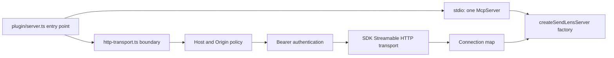
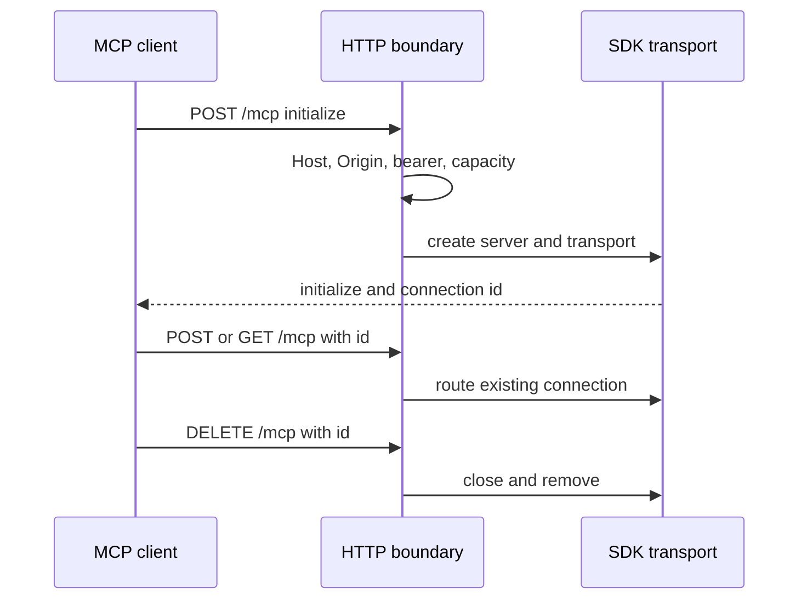
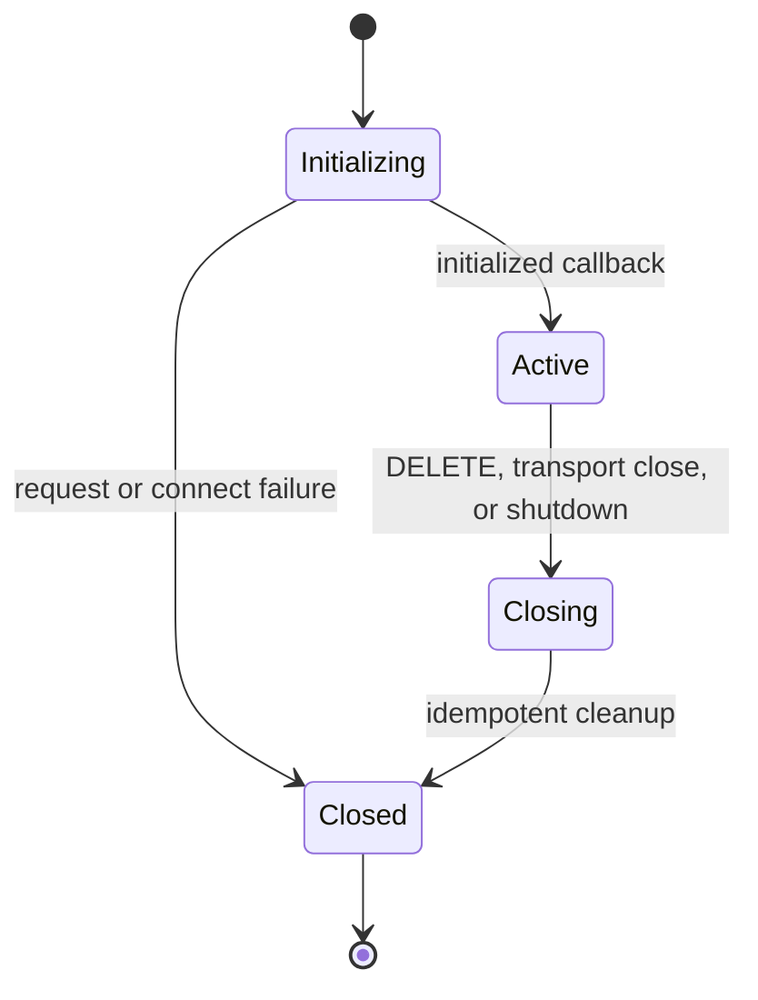

# Streamable HTTP Transport

## Goal Capsule

Add an opt-in, authenticated MCP Streamable HTTP transport for remote deployments while preserving stdio as the default and leaving SendLens tools, response contracts, demo mode, provider behavior, and local-first privacy guarantees unchanged.

Success means a generic MCP client can initialize, list tools, invoke a tool, and close a session over HTTP only when bearer, Host, and Origin policy all permit the request. Invalid configuration and requests fail closed without leaking credentials, request bodies, session identifiers, or provider data.

## Product Contract

### Requirements

- **R1 — Transport selection:** `SENDLENS_TRANSPORT=stdio|http`; unset means `stdio`, and any other value fails startup.
- **R2 — Stdio parity:** the existing stdio connection, stdout discipline, tool registry, schemas, responses, demo mode, and setup behavior remain unchanged.
- **R3 — Standard HTTP:** HTTP mode exposes the SDK's stateful Streamable HTTP transport at `POST`, `GET`, and `DELETE /mcp`.
- **R4 — Fail-closed bearer auth:** HTTP startup requires a deployment bearer secret with at least 32 UTF-8 bytes. Every MCP `POST`, `GET`, and `DELETE` requires an Authorization bearer value and uses digest-based timing-safe comparison. Browser `OPTIONS` preflight is the only exception and remains behind Host/Origin policy. Credentials are never logged.
- **R5 — Host validation:** the hostname parsed from each HTTP Host header must exactly match a configured allowed hostname. Matching is port-agnostic. Loopback binds receive a localhost-only default; wildcard/public binds require an explicit allowlist.
- **R6 — Origin validation:** an absent `Origin` is accepted for non-browser MCP clients. A present Origin must exactly match the configured allowed origins; the default is empty, so browser-origin requests fail closed. CORS never uses `*`; allowed browser origins receive narrow preflight methods and headers.
- **R7 — Minimal health:** `GET /health` is unauthenticated but still Host/Origin checked and returns only `{status, version, transport}`.
- **R8 — Bounded input:** JSON request bodies are capped at 100 KiB. Oversized and malformed bodies return generic errors without echoing input.
- **R9 — Session lifecycle:** one `McpServer` and `StreamableHTTPServerTransport` are created per initialized connection; later requests route by `Mcp-Session-Id`; `DELETE` closes and removes it.
- **R10 — Capacity:** the HTTP connection cap defaults to 100 and must be an integer from 1 through 1000. New initialization requests receive 503 when the cap is reached.
- **R11 — Safe teardown:** transport close callbacks and process shutdown remove active connections and close transports/servers exactly once.
- **R12 — Safe errors/logging:** HTTP failures use generic messages and lifecycle logs go to stderr without headers, credentials, request bodies, connection identifiers, query strings, or provider/customer data.
- **R13 — One workspace:** one HTTP process serves the single configured SendLens workspace; multi-tenancy and per-request provider credentials are unsupported.
- **R14 — Generic deployment docs:** document configuration and security prerequisites without adding a vendor-specific deploy target.
- **R15 — Release contract:** advance both package manifests together from `0.1.68` to the next still-unreleased patch version before PR creation.

### Acceptance Examples

- **AE1:** With no transport variable, an SDK stdio client initializes and lists the same tool names as before.
- **AE2:** HTTP mode with a valid 32+ byte deployment secret, allowed Host, and no Origin supports initialize, list tools, `setup_doctor`, and close through the official SDK client.
- **AE3:** Missing, malformed, or incorrect bearer values all receive the same 401 response and do not appear in logs.
- **AE4:** A disallowed Host or a present, disallowed Origin is rejected before MCP handling; an explicitly allowed browser Origin receives narrow CORS headers.
- **AE5:** Missing/unknown connections, malformed JSON, oversized bodies, cap exhaustion, and shutdown are deterministic, bounded, and privacy-safe.
- **AE6:** `/health` reveals no provider state, campaign data, credential state, connection count, workspace path, or environment data.

### Scope Boundaries

In scope: transport selection, one authenticated Streamable HTTP endpoint, exact Host/Origin policy, bounded parsing, stateful connections, minimal health/readiness, tests, generic docs, and the release version bump.

Out of scope: deployment-vendor configuration, TLS termination, OAuth, user accounts, billing, dashboard UI, shared databases, multi-tenancy, per-request workspaces, provider mutations, webhook ingestion, and changes to MCP tools or response schemas.

## Planning Contract

### Decisions

- **KTD1:** Use installed `@modelcontextprotocol/sdk` v1 APIs for Streamable HTTP framing and Host middleware. Construct the Express app directly so security middleware executes before bounded JSON parsing.
- **KTD2:** Refactor global tool registration into `createSendLensServer()` so stdio creates one server and HTTP creates one server per initialized connection.
- **KTD3:** Keep HTTP orchestration in `plugin/http-transport.ts`; `plugin/server.ts` owns transport selection and the executable entry point.
- **KTD4:** Hash both configured and supplied bearer values with SHA-256 and compare fixed-length digests with `timingSafeEqual`; never compare raw variable-length secrets.
- **KTD5:** Mount Host and Origin policy first, health second, bearer auth on `/mcp` third, then a 100 KiB JSON parser for `/mcp` POST requests. Install a terminal privacy-safe parser/error handler.
- **KTD6:** Treat allowlists as exact comma-separated values after trimming and rejecting empty/invalid entries. Do not infer proxy headers or trust `X-Forwarded-Host`.
- **KTD7:** Export an HTTP controller with bound address and idempotent `close()` so tests can bind port `0` without subprocess races.
- **KTD8:** Signal handlers are installed only by the executable HTTP path; library/test callers own controller teardown.
- **KTD9:** Add Express as a direct production dependency and its types as a development dependency rather than relying on the SDK's transitive install.

### Configuration Contract

| Variable | Default | Validation |
|---|---:|---|
| Transport mode | `stdio` | exactly `stdio` or `http` |
| HTTP bind host | `127.0.0.1` | non-empty host |
| HTTP port | `3000` | integer 0–65535; 0 is for tests |
| HTTP bearer secret | none | required in HTTP mode; at least 32 UTF-8 bytes |
| Allowed Hosts | loopback-only values for loopback bind | exact comma-separated hostnames without ports; required for wildcard/public bind |
| Allowed Origins | empty | exact absolute `http:` or `https:` origins with no path/query/fragment |
| Maximum connections | `100` | integer 1–1000 |

### Architecture

### System Impact and Risks

- Shared behavior changes only through a server factory; response-contract and stdio integration tests guard parity.
- Authentication is transport-level. Requests reach the SDK only after Host, Origin, and bearer checks.
- TLS remains an operator responsibility. Public exposure requires HTTPS termination and a rotated deployment secret.
- Connection state is process-local and lost on restart. Horizontal replicas require sticky routing and are not promised here.
- `createMcpExpressApp` Host validation and JSON parser are version-sensitive SDK behaviors; focused tests pin expected boundary behavior.
- Prevent a capacity race by reserving a slot before awaiting connection/initialization and releasing it on every failure path.
- Health cannot prove provider connectivity because doing so would expose or exercise private workspace state.

## Implementation Units

### U1 — Server factory and transport selector

**Files:** `plugin/server.ts`, existing stdio tests.

Wrap current registration in exported `createSendLensServer()`, preserve environment loading, guard startup with `require.main === module`, and select stdio or HTTP from validated configuration. Keep stdout owned by the stdio transport.

**Tests:** default/unset stdio initializes and lists tools; invalid transport fails; response-contract tests remain unchanged.

### U2 — HTTP boundary and connection manager

**Files:** `plugin/http-transport.ts`.

Add typed configuration parsing; exact Host/Origin middleware; narrow allowed-origin preflight; timing-safe bearer middleware; minimal health; `/mcp` POST/GET/DELETE routing; per-connection server/transport creation; capacity reservation; idempotent cleanup; generic parser/error handling; and controller shutdown.

**Tests:** all R3–R12 paths, including missing/empty/error inputs, wrong auth, present disallowed Origin, malformed/oversized bodies, unknown ids, cap exhaustion, transport close, and double close.

### U3 — Official-client behavioral proof

**Files:** focused integration test and package scripts.

Start HTTP on loopback port 0 and prove initialize, list, call, and close using the official Streamable HTTP client. Add negative raw request checks and wire the test into the plugin smoke tier.

### U4 — Operator documentation and release surface

**Files:** project readme, transport and trust docs, and both package manifests.

Document stdio default, variables, HTTPS, proxy Host behavior, exact Origin behavior, one-process/one-workspace, process limits, health, and client endpoint. Bump both manifests to the next unreleased patch.

## Verification Contract

- Focused HTTP proof: `npm run test:http-transport`.
- Existing stdio/runtime and response-contract proof: `npm run test:plugin:smoke` and `npm run test:mcp-response-contract`.
- Full plugin behavior: `npm run test:plugin`.
- Structure and lint: `npm run validate:plugin` and `npm run lint:plugin`.
- Host distribution: `npm run validate:host-bundles`.
- Hygiene: `git diff --check` and a credential/data exposure scan of changed files.
- Manual staging gate: connect the official MCP Inspector or client to a TLS-terminated deployment and repeat initialize/list/call/close before production rollout. Record this as pending when no deployment is in scope.

## Definition of Done

- R1–R15 and AE1–AE6 are covered by code, automated tests, or the named manual staging gate.
- Stdio remains default and passes existing smoke/full tests without contract drift.
- HTTP startup and requests fail closed for invalid security configuration or policy.
- Logs and errors contain none of the configured/supplied credential, connection id, body canaries, workspace paths, or provider data.
- Documentation covers a generic HTTPS deployment and intentional limitations.
- Both package manifests contain the same new unreleased version.
- Focused security/correctness review has no unresolved P0/P1 findings; human security approval remains required before merge.
- The PR targets `main`, links SENDOSS-120, omits automated-repair enrollment, and leaves Linear in review until human approval/merge.
