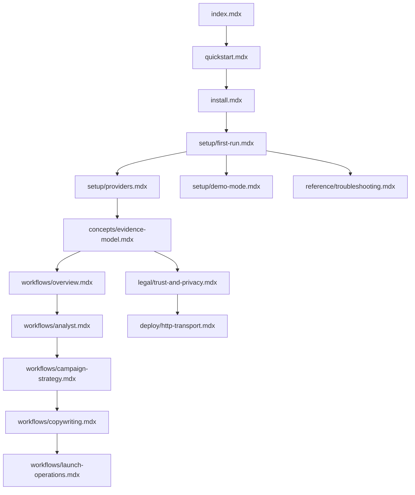

# SendLens Mintlify Public Docs For Closed Source - Plan

## Goal Capsule

| Field | Value |
| --- | --- |
| Objective | Create a Mintlify documentation surface that becomes SendLens' public customer and operator docs when the product repository becomes closed source. |
| Authority | Repo `AGENTS.md`, current public docs in `README.md` and `docs/`, Mintlify `docs.json` navigation conventions, SendLens privacy/read-only product boundary. |
| Execution profile | Docs-first implementation: add a Mintlify source tree, migrate public-safe content, remove public dependency on GitHub source visibility, and validate docs locally before publishing. |
| Stop conditions | Do not publish secrets, raw customer data, private repo implementation notes, direct private-repository asset URLs, or provider mutation guidance. Stop only if implementation is asked to make unauthenticated private-repository assets a public install dependency before the distribution model is settled. |
| Tail ownership | Implementation should land in a docs PR with Mintlify preview validation and a closed-source readiness checklist before the repo visibility changes. |

---

## Product Contract

### Summary

SendLens needs a public docs site that no longer assumes the GitHub repository is visible.
Mintlify should become the canonical customer-facing surface for installation, first-run setup, provider configuration, workflow usage, evidence boundaries, privacy posture, deployment options, and troubleshooting.
The existing repo docs provide strong source material, but they currently mix customer docs, source-development instructions, direct GitHub Release links, and internal Orchid artifacts.

The first implementation should create a Mintlify docs source tree in the repo, not move all existing docs in place.
That keeps `docs/orchid/` and repo-internal operating artifacts out of the public docs namespace while allowing Mintlify's monorepo path setting to build from the new docs directory.

### Problem Frame

When the repository goes closed source, the README and repo docs stop being a reliable public help center.
The docs site must answer the questions a buyer, operator, or AI-host user has without exposing private source implementation details or depending on public GitHub access.
It also needs to preserve SendLens' most important trust claims: local-first cache, read-only providers, exact/sampled/reconstructed evidence labels, and secret-safe setup.

### Requirements

**Closed-source public surface**

- R1. The Mintlify site must replace GitHub repository pages as the canonical public SendLens documentation surface.
- R2. Public docs must avoid promising source access, direct source checkout workflows, open-source contribution paths, or public GitHub Release assets unless those assets remain publicly downloadable after the visibility change.
- R3. Public docs must keep all internal Orchid workflow artifacts, Linear process, PR workflow details, and `.agent-artifacts/` material out of the Mintlify navigation.
- R4. Public docs must preserve SendLens' public product identity as a local-first, read-only outbound analyst for AI hosts.

**Onboarding and install**

- R5. The docs must provide a short quickstart for Claude Code, Cursor, Codex, and OpenCode, using `https://sendlens.app/install.sh` as the canonical installer entrypoint.
- R6. The docs must include first-run setup with `/sendlens-setup`, demo mode, host reload steps, provider env variables, client-scoped cache setup, and key rotation/restart guidance.
- R7. The docs must include an explicit closed-source distribution decision point for replacing or preserving direct GitHub Release asset links.

**Provider and evidence model**

- R8. The docs must explain Instantly, Smartlead V1, and all-provider mode in customer language while preserving read-only scope and Smart Delivery support-gated caveats.
- R9. The docs must teach evidence labels: exact, sampled, hybrid, reconstructed, fetched, inferred, and unsupported.
- R10. The docs must explain that empty or unavailable evidence never proves health, especially for Smartlead Smart Delivery and inbox-placement surfaces.

**Workflow docs**

- R11. The docs must expose the five public SendLens skills as user workflows, not as implementation internals: setup, analyst, campaign strategist, copywriter, and launch operator.
- R12. The docs must give buyer/operator examples for campaign triage, reply analysis, ICP signals, copy analysis, launch QA, account-manager briefs, and end-to-end campaign planning.
- R13. The docs must keep legacy command pages discoverable only where they help existing users migrate to the five public skills.

**Trust, privacy, and operations**

- R14. The docs must carry the privacy boundary from `docs/TRUST_AND_PRIVACY.md`: local DuckDB default, provider API access, AI host/model context caveat, redacted setup output, and no SendLens-hosted warehouse for the core stdio workflow.
- R15. The docs must include HTTP transport and container deployment pages as operator/enterprise docs with one-workspace, bearer-token, Host/Origin, HTTPS, and log-sanitization requirements.
- R16. The docs must keep troubleshooting actionable without asking users to inspect private source files.

**Mintlify structure and quality**

- R17. The docs implementation must include a Mintlify `docs.json` with `$schema`, branding, navigation, redirects, and a structure that fits customer tasks.
- R18. The navigation should use top-level groups first; tabs or anchors should be added only if the final IA needs a second top-level axis.
- R19. Pages must use root-relative internal links, explicit prerequisites, stable custom anchors for high-traffic reference sections, and redirects for moved public URLs.
- R20. Docs validation must run Mintlify validation and broken-link checks before merge, plus repo guidance checks from `AGENTS.md`.

### Actors

- A1. First-time user installing SendLens into an AI host.
- A2. Agency/operator connecting client workspaces and maintaining local caches.
- A3. Buyer/evaluator reviewing whether SendLens is safe to use with outbound data.
- A4. Enterprise operator deploying the single-tenant HTTP transport.
- A5. Internal SendLens maintainer preserving public docs while the product source closes.

### Key Flows

- F1. First install to useful answer
  - **Trigger:** A user reaches the docs from the marketing site.
  - **Actors:** A1, A2
  - **Steps:** Read overview, run installer, reload host, run `/sendlens-setup`, add provider env or demo mode, ask first analysis question.
  - **Outcome:** User understands what is local, what credentials are needed, and what question to ask next.
  - **Covered by:** R4, R5, R6, R11, R12

- F2. Closed-source proof and trust review
  - **Trigger:** A buyer wants to know what data leaves the machine.
  - **Actors:** A3
  - **Steps:** Read trust overview, local storage, provider access, AI host caveat, evidence labels, and read-only boundary.
  - **Outcome:** Buyer can assess whether SendLens fits their privacy posture without needing repo source access.
  - **Covered by:** R1, R4, R8, R9, R14

- F3. Existing OSS-user migration
  - **Trigger:** Existing users have old README or GitHub links bookmarked.
  - **Actors:** A1, A5
  - **Steps:** Follow redirects, land on matching Mintlify page, see current installer/distribution guidance, avoid stale direct-release links.
  - **Outcome:** Existing public docs paths continue to work during the close-source transition.
  - **Covered by:** R2, R7, R17, R19

- F4. Enterprise HTTP deployment
  - **Trigger:** An operator wants remote MCP access for one configured workspace.
  - **Actors:** A4
  - **Steps:** Read prerequisites, set HTTP env vars, deploy behind HTTPS, configure Host/Origin and bearer token, run MCP Inspector proof, check logs.
  - **Outcome:** Operator can deploy without confusing HTTP mode for SaaS multi-tenancy.
  - **Covered by:** R14, R15, R16

### Acceptance Examples

- AE1. Closed-source install page avoids private release links
  - **Given:** The repository is private and unauthenticated GitHub Release asset downloads are unavailable.
  - **When:** A user opens the Mintlify install guide.
  - **Then:** The page uses `https://sendlens.app/install.sh` or another public distribution URL and does not instruct unauthenticated users to download private GitHub assets.
  - **Covers:** R2, R5, R7

- AE2. Setup page preserves secret safety
  - **Given:** A Smartlead user is configuring `SENDLENS_SMARTLEAD_API_KEY`.
  - **When:** They read setup and troubleshooting guidance.
  - **Then:** The docs never ask them to paste the key into chat and explain that Smartlead query-string values are suppressed from logs and errors.
  - **Covers:** R6, R8, R14, R16

- AE3. Evidence docs prevent overclaiming
  - **Given:** A user sees no Smart Delivery rows after a Smartlead refresh.
  - **When:** They read the evidence model page.
  - **Then:** The docs say unsupported or empty Smart Delivery evidence does not prove healthy placement.
  - **Covers:** R8, R9, R10

- AE4. Public docs exclude internal artifacts
  - **Given:** Mintlify navigation is generated.
  - **When:** A visitor searches or browses the public docs.
  - **Then:** `docs/orchid/`, Linear lifecycle, agent worktree rules, raw QA artifacts, and internal PR process pages are absent from public navigation.
  - **Covers:** R3, R17

### Scope Boundaries

**In scope for the first Mintlify pass**

- Public IA, `docs.json`, and migrated MDX pages.
- Closed-source-safe rewrites of existing README and `docs/` customer/operator content.
- Redirect map for old public docs paths that should remain stable.
- Validation scripts for Mintlify docs checks.

**Deferred**

- Full API playground generated from OpenAPI, because SendLens currently exposes MCP tools rather than a public REST API surface.
- Auth-gated private customer docs, unless Brandon chooses to make parts of Mintlify private.
- Search/analytics optimization beyond basic metadata and navigation.
- Designer polish beyond using current SendLens assets and brand color.

**Out of scope**

- Provider write APIs, campaign mutation guidance, email sending features, webhook management, or Smartlead mutation paths.
- Publishing internal Orchid process docs.
- Changing the product runtime, installer behavior, release pipeline, or repo visibility itself.

---

## Planning Contract

### Key Technical Decisions

- KTD1. Use `docs-site/` as the Mintlify source root, not the existing `docs/` directory. This avoids accidentally publishing `docs/orchid/` and existing repo-internal docs while supporting Mintlify's monorepo docs-subdirectory deployment setting.
- KTD2. Start with grouped navigation instead of top-level tabs. SendLens is one product with one primary onboarding path; groups are the simplest fit unless public API/reference content becomes a separate top-level axis.
- KTD3. Treat `https://sendlens.app/install.sh` as the public installer canonical path. Direct GitHub Release asset links should move behind an explicit distribution decision because a private repo can break unauthenticated downloads.
- KTD4. Convert repo docs to public MDX by audience and task, not one-to-one by file. Current docs mix customer guidance, source-development commands, and internal process; copying them verbatim would leak irrelevant or closed-source-hostile instructions.
- KTD5. Keep MCP tool reference manual, not OpenAPI-generated, for the first pass. Mintlify OpenAPI generation is valuable for HTTP APIs, but SendLens' public integration surface is MCP tools and host workflows rather than a REST endpoint catalog.
- KTD6. Preserve evidence posture as a docs primitive. Every workflow page should link back to the evidence model instead of restating caveats inconsistently.
- KTD7. Add redirects for public paths that already exist or were linked from the README. Close-source migration should not strand users with bookmarked README/docs links where a Mintlify equivalent exists.

### Proposed Mintlify Source Tree

```text
docs-site/
  docs.json
  index.mdx
  quickstart.mdx
  install.mdx
  setup/
    first-run.mdx
    providers.mdx
    demo-mode.mdx
    clients-and-caches.mdx
  concepts/
    local-first-privacy.mdx
    evidence-model.mdx
    providers.mdx
    read-only-boundary.mdx
  workflows/
    overview.mdx
    analyst.mdx
    campaign-strategy.mdx
    copywriting.mdx
    launch-operations.mdx
    account-briefs.mdx
  use-cases/
    campaign-triage.mdx
    reply-analysis.mdx
    icp-signals.mdx
    copy-analysis.mdx
    deliverability.mdx
    end-to-end-campaign.mdx
  reference/
    mcp-tools.mdx
    configuration.mdx
    troubleshooting.mdx
    glossary.mdx
  deploy/
    http-transport.mdx
    container.mdx
  legal/
    trust-and-privacy.mdx
  migration/
    closed-source-transition.mdx
```

### Launch Phasing

| Phase | Pages | Purpose |
| --- | --- | --- |
| P0 public launch | `index.mdx`, `quickstart.mdx`, `install.mdx`, `setup/first-run.mdx`, `setup/providers.mdx`, `setup/demo-mode.mdx`, `concepts/local-first-privacy.mdx`, `concepts/evidence-model.mdx`, `concepts/read-only-boundary.mdx`, `workflows/overview.mdx`, `reference/troubleshooting.mdx`, `legal/trust-and-privacy.mdx` | Replace the public README/docs dependency before close-source. |
| P1 workflow depth | `workflows/*.mdx`, `use-cases/campaign-triage.mdx`, `use-cases/reply-analysis.mdx`, `use-cases/icp-signals.mdx`, `use-cases/copy-analysis.mdx`, `use-cases/deliverability.mdx` | Teach day-to-day usage and link examples back to evidence labels. |
| P2 operator and transition depth | `deploy/*.mdx`, `reference/mcp-tools.mdx`, `reference/configuration.mdx`, `reference/glossary.mdx`, `migration/closed-source-transition.mdx`, remaining use-case pages | Support enterprise operators, MCP reference readers, and existing OSS-user migration. |

### Proposed Navigation

```json
{
  "$schema": "https://mintlify.com/docs.json",
  "theme": "mint",
  "name": "SendLens Docs",
  "colors": {
    "primary": "#0F766E"
  },
  "navigation": {
    "groups": [
      {
        "group": "Start here",
        "pages": ["index", "quickstart", "install", "setup/first-run", "setup/demo-mode"]
      },
      {
        "group": "Core concepts",
        "pages": ["concepts/local-first-privacy", "concepts/evidence-model", "concepts/providers", "concepts/read-only-boundary"]
      },
      {
        "group": "Workflows",
        "pages": ["workflows/overview", "workflows/analyst", "workflows/campaign-strategy", "workflows/copywriting", "workflows/launch-operations", "workflows/account-briefs"]
      },
      {
        "group": "Use cases",
        "pages": ["use-cases/campaign-triage", "use-cases/reply-analysis", "use-cases/icp-signals", "use-cases/copy-analysis", "use-cases/deliverability", "use-cases/end-to-end-campaign"]
      },
      {
        "group": "Reference",
        "pages": ["reference/mcp-tools", "reference/configuration", "reference/troubleshooting", "reference/glossary"]
      },
      {
        "group": "Deploy",
        "pages": ["deploy/http-transport", "deploy/container"]
      },
      {
        "group": "Trust",
        "pages": ["legal/trust-and-privacy", "migration/closed-source-transition"]
      }
    ]
  }
}
```

### Source Mapping

| New page | Primary source material | Rewrite posture |
| --- | --- | --- |
| `index.mdx` | `README.md`, `assets/README.md`, `pluxx.config.ts` brand copy | Public product overview; no GitHub-source dependency. |
| `quickstart.mdx` | `README.md`, `docs/INSTALL.md` | Fast path to install, setup, demo, and first question. |
| `install.mdx` | `docs/INSTALL.md`, `site/app/install.sh/route.js`, installer notes in `README.md` | Replace direct GitHub asset links unless public distribution remains confirmed. |
| `setup/first-run.mdx` | `docs/skills/sendlens-setup.md`, `docs/TROUBLESHOOTING.md` | Customer-safe host reload and doctor flow. |
| `setup/providers.mdx` | `README.md`, `docs/TRUST_AND_PRIVACY.md`, provider docs | Explain Instantly, Smartlead, and all-provider mode. |
| `setup/demo-mode.mdx` | `README.md`, `docs/examples/SYNTHETIC_OUTPUTS.md` | Public-safe synthetic demo path. |
| `setup/clients-and-caches.mdx` | `README.md`, `docs/TRUST_AND_PRIVACY.md`, `docs/operator-memory/` only if public-safe | Multi-client cache and env overlay guidance. |
| `concepts/local-first-privacy.mdx` | `docs/TRUST_AND_PRIVACY.md` | Buyer-safe trust explainer. |
| `concepts/evidence-model.mdx` | `README.md`, `docs/MCP_RESPONSE_CONTRACT.md`, `docs/TRUST_AND_PRIVACY.md` | Canonical evidence label definitions and caveats. |
| `concepts/providers.mdx` | `README.md`, `docs/SMARTLEAD_PROVIDER_CONTRACT.md`, `docs/SMARTLEAD_API_PARITY_MAP.md` | Public provider capability narrative; avoid internal parity backlog details. |
| `concepts/read-only-boundary.mdx` | `README.md`, `docs/TRUST_AND_PRIVACY.md`, `AGENTS.md` product context | State no mutation paths. |
| `workflows/*.mdx` | `docs/skills/*.md`, `skills/*/SKILL.md` public sections | Turn skill docs into task-based user docs. |
| `use-cases/*.mdx` | README examples, `docs/examples/SYNTHETIC_OUTPUTS.md`, `docs/skills/*.md` | Public examples with synthetic or generalized evidence only. |
| `reference/mcp-tools.mdx` | `docs/MCP_RESPONSE_CONTRACT.md`, `docs/CATALOG.md` | User/operator reference, not internal schema dump. |
| `reference/configuration.mdx` | `README.md`, `docs/INSTALL.md`, `docs/TRUST_AND_PRIVACY.md` | Env var reference with secret-safety callouts. |
| `reference/troubleshooting.mdx` | `docs/TROUBLESHOOTING.md` | Remove private source-build assumptions from customer paths. |
| `deploy/http-transport.mdx` | `docs/HTTP_TRANSPORT.md` | Enterprise operator page. |
| `deploy/container.mdx` | `docs/CONTAINER_DEPLOYMENT.md` | Single-tenant deployment page. |
| `legal/trust-and-privacy.mdx` | `docs/TRUST_AND_PRIVACY.md` | Canonical legal/trust doc. |
| `migration/closed-source-transition.mdx` | `README.md`, `docs/INSTALL.md`, release/distribution decisions | Explain where docs, installers, support, and release notes live after close-source. |

### High-Level Content Flow



### Implementation Constraints

- Use MDX files under `docs-site/`; do not repurpose `docs/orchid/` or publish internal artifacts.
- Keep public examples synthetic, redacted, or generic.
- Use root-relative Mintlify links for internal navigation.
- Add stable custom anchor IDs on heavily linked headings such as evidence labels, install commands, provider env vars, and read-only boundaries.
- Include descriptive link text and prerequisites at the top of setup/deploy pages.
- Include a redirect map once final slugs are chosen.
- If a docs page must reference GitHub after close-source, label the access expectation: public release channel, authenticated customer portal, or maintainer-only source.

### Dependencies and Open Decisions

- D1. Confirm whether release installers and tarballs remain public after the GitHub repository becomes private. Implementation can proceed by using `sendlens.app/install.sh` as the only canonical install path and deferring direct tarball links until the public artifact channel is confirmed.
- D2. Confirm Mintlify deployment source: same private repo with `docs-site/` as subdirectory, separate docs-only repo, or Mintlify-hosted repo cloned into Orchid GitHub.
- D3. Confirm whether any docs pages need authentication. The first pass assumes public docs with no customer-specific data.
- D4. Confirm final docs URL, likely `docs.sendlens.app` or `sendlens.app/docs`.
- D5. Confirm brand assets and favicon export paths for Mintlify.

### Research Notes

- Mintlify requires `docs.json` with `name`, `theme`, `colors.primary`, and `navigation`; adding `$schema` improves editor validation.
- Mintlify's `navigation` object supports groups, tabs, anchors, dropdowns, products, versions, and languages; groups are the simplest single-product pattern.
- Mintlify supports building from a docs subdirectory in a monorepo, so `docs-site/` can be used without moving the repository root.
- Mintlify recommends root-relative internal links, explicit prerequisites, redirects for moved pages, and `mint broken-links` before publishing.
- Mintlify OpenAPI generation targets OpenAPI 3.0/3.1 specifications and API endpoint docs; this should wait until SendLens has a public HTTP API reference separate from MCP tool docs.

---

## Implementation Units

### U1. Add Mintlify project skeleton

- **Goal:** Create the docs source tree and initial site config without publishing internal repo docs.
- **Requirements:** R1, R3, R17, R18
- **Files:** `docs-site/docs.json`, `docs-site/index.mdx`, `docs-site/quickstart.mdx`, `docs-site/install.mdx`, `docs-site/_snippets/` if snippets are used.
- **Approach:** Add `docs-site/` with a minimal valid `docs.json`, SendLens branding, grouped navigation, and first three pages that establish positioning, quickstart, and install path.
- **Test scenarios:**
  - A Mintlify validation run finds `docs-site/docs.json` and all pages referenced by navigation.
  - `docs-site/` search contains no references to `docs/orchid/`, Linear issue keys, `.agent-artifacts/`, or maintainer worktree instructions.
  - Install page avoids unauthenticated direct GitHub Release asset URLs unless D1 is resolved in favor of public assets.
- **Verification:** `cd docs-site && npx mint@latest validate` or the installed Mintlify CLI equivalent; `cd docs-site && npx mint@latest broken-links` if supported by the active CLI; `git diff --check`.

### U2. Migrate setup, provider, and configuration docs

- **Goal:** Give users a closed-source-safe first-run and provider setup path.
- **Requirements:** R5, R6, R7, R8, R14, R16
- **Files:** `docs-site/setup/first-run.mdx`, `docs-site/setup/providers.mdx`, `docs-site/setup/demo-mode.mdx`, `docs-site/setup/clients-and-caches.mdx`, `docs-site/reference/configuration.mdx`, `docs-site/reference/troubleshooting.mdx`.
- **Approach:** Rewrite from `README.md`, `docs/INSTALL.md`, `docs/TROUBLESHOOTING.md`, and `docs/skills/sendlens-setup.md`; remove source-development-only commands from primary customer flows and put maintainer-only source workflows out of public nav.
- **Test scenarios:**
  - Setup docs tell users to run `/sendlens-setup` after install and explain host reload actions.
  - Provider docs cover `SENDLENS_INSTANTLY_API_KEY`, `SENDLENS_SMARTLEAD_API_KEY`, `SENDLENS_PROVIDER`, `SENDLENS_CLIENT`, `SENDLENS_DB_PATH`, and `SENDLENS_STATE_DIR` without printing or requesting secret values.
  - Troubleshooting paths do not require reading private source files.
- **Verification:** Mintlify validate, broken-link check, and text grep for forbidden source-only guidance.

### U3. Create concepts and trust docs

- **Goal:** Make the trust model understandable without source-code access.
- **Requirements:** R4, R8, R9, R10, R14
- **Files:** `docs-site/concepts/local-first-privacy.mdx`, `docs-site/concepts/evidence-model.mdx`, `docs-site/concepts/providers.mdx`, `docs-site/concepts/read-only-boundary.mdx`, `docs-site/legal/trust-and-privacy.mdx`.
- **Approach:** Convert `docs/TRUST_AND_PRIVACY.md`, README capability matrix, `docs/MCP_RESPONSE_CONTRACT.md`, and Smartlead contract material into reader-facing pages with repeated links back to the canonical evidence model.
- **Test scenarios:**
  - Evidence page defines exact, sampled, hybrid, reconstructed, fetched, inferred, and unsupported with SendLens examples.
  - Provider page states Smart Delivery is support-gated and missing rows do not prove health.
  - Trust page states MCP tool results enter the user's AI host/model context and that host/model handling is outside SendLens' direct control.
- **Verification:** Mintlify validate; privacy/safety copy review against `docs/TRUST_AND_PRIVACY.md`.

### U4. Build workflow and use-case docs

- **Goal:** Show how users should operate SendLens through the five public skills and common outbound analysis use cases.
- **Requirements:** R11, R12, R13
- **Files:** `docs-site/workflows/overview.mdx`, `docs-site/workflows/analyst.mdx`, `docs-site/workflows/campaign-strategy.mdx`, `docs-site/workflows/copywriting.mdx`, `docs-site/workflows/launch-operations.mdx`, `docs-site/workflows/account-briefs.mdx`, `docs-site/use-cases/*.mdx`.
- **Approach:** Start from `docs/skills/*.md` and README examples, then write task-oriented pages with prerequisites, example prompts, expected evidence, and next-step handoffs.
- **Test scenarios:**
  - Workflow overview teaches setup → analyst → strategy → copywriter → launch operator without implying provider mutations.
  - Use-case pages include prompt examples and explicitly state when to load one campaign before deep analysis.
  - Legacy command names appear only as migration/discoverability notes, not as the primary IA.
- **Verification:** Mintlify validate; grep for mutation verbs paired with provider actions; manual read-through of evidence language.

### U5. Add reference, deploy, redirects, and validation scripts

- **Goal:** Complete the customer/operator reference layer and make docs validation repeatable.
- **Requirements:** R15, R16, R17, R19, R20
- **Files:** `docs-site/reference/mcp-tools.mdx`, `docs-site/reference/glossary.mdx`, `docs-site/deploy/http-transport.mdx`, `docs-site/deploy/container.mdx`, `docs-site/migration/closed-source-transition.mdx`, `docs-site/docs.json`, `package.json` if scripts are added.
- **Approach:** Add manually curated MCP and deployment references; add redirects in `docs.json` for old public paths; add repo scripts such as `docs:validate` and `docs:broken-links` if the team wants local CI affordances.
- **Test scenarios:**
  - `docs.json` redirects cover old README-linked docs equivalents such as install, trust/privacy, troubleshooting, HTTP transport, and skill docs.
  - HTTP transport page preserves one-workspace and bearer-token boundaries.
  - Docs validation commands are documented and runnable from the repo root.
- **Verification:** Mintlify validate, broken-link check, repo preflight, and `git diff --check`.

### U6. Closed-source readiness review

- **Goal:** Ensure the docs can go live before the repo visibility flips.
- **Requirements:** R1, R2, R3, R7, R14, R20
- **Files:** `docs-site/**`, `docs/orchid/qa/<date>-sendlens-mintlify-docs.md`.
- **Approach:** Run a focused audit for public/private boundary, broken links, distribution links, and privacy claims; record QA evidence in `docs/orchid/qa/`.
- **Test scenarios:**
  - Search for `github.com/orchidautomation/sendlens-plugin` in `docs-site/` and classify every occurrence as public-safe or replace it.
  - Search for `open-source`, `clone`, `npm install`, `pluxx install`, `.env`, and secret variable examples to confirm each appears only in the intended customer or maintainer context.
  - Confirm Mintlify preview does not expose hidden/internal pages.
- **Verification:** QA artifact with validation commands, link audit findings, and preview URL or screenshot reference.

---

## Verification Contract

| Gate | Command or check | Applies to | Done signal |
| --- | --- | --- | --- |
| Repo preflight | `/home/brandon/.codex/plugins/cache/personal/orchid-agent-stack/0.1.0+codex.20260621000222/scripts/repo-preflight.sh .` | Planning and implementation | No failures; warnings are explained. |
| Markdown/doc hygiene | `git diff --check` | Every docs change | No whitespace or patch hygiene errors. |
| Mintlify config validation | `cd docs-site && npx mint@latest validate` or installed `mint validate` equivalent from `docs-site/` | U1-U6 | `docs.json` and MDX pages validate. |
| Broken links | `cd docs-site && npx mint@latest broken-links` or installed `mint broken-links` equivalent from `docs-site/` | U1-U6 | No broken internal links. |
| Public/private boundary grep | `rg -n "docs/orchid|agent-artifacts|Linear|worktree|open-source|github.com/orchidautomation/sendlens-plugin" docs-site` | U6 | Every hit is removed or intentionally public-safe. |
| Secret safety grep | `rg -n "API_KEY|TOKEN|SECRET|BLOB_READ_WRITE_TOKEN" docs-site` | U2, U3, U5, U6 | Env var names may appear; no real values, private tokens, or instructions to paste secrets into chat. |
| Product boundary review | Manual review against `docs/TRUST_AND_PRIVACY.md` and `AGENTS.md` | U3-U6 | Read-only, local-first, evidence-label, and Smartlead caveats match existing contracts. |

---

## Definition of Done

- U1. `docs-site/docs.json` and the initial index/quickstart/install pages exist, validate, and exclude internal Orchid artifacts.
- U2. Setup, provider, demo, client/cache, configuration, and troubleshooting pages are closed-source-safe and secret-safe.
- U3. Concepts and trust pages preserve local-first, read-only, evidence, provider, AI-host, and Smartlead caveats.
- U4. Workflow and use-case pages make the five public SendLens skills the primary user experience and keep legacy commands secondary.
- U5. Reference/deploy/migration pages and redirects are present, and local validation commands are documented or scripted.
- U6. A QA artifact records validation output, public/private boundary audit, link audit, and any unresolved distribution decisions.
- The docs PR states whether direct GitHub Release asset links remain public after close-source; if unknown, the PR must not ship those links as canonical install paths.
- No docs page includes raw customer data, secrets, private repo implementation notes, or provider mutation guidance.

---

## Appendix

### Mintlify source notes

- Mintlify global settings: https://www.mintlify.com/docs/organize/settings
- Mintlify navigation: https://www.mintlify.com/docs/organize/navigation
- Mintlify monorepo setup: https://www.mintlify.com/docs/deploy/monorepo
- Mintlify linking and broken links: https://www.mintlify.com/docs/guides/linking
- Mintlify OpenAPI setup: https://www.mintlify.com/docs/api-playground/openapi-setup
