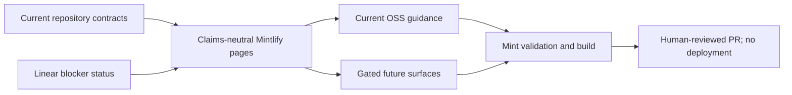

# SendLens Claims-Neutral Mintlify Shell - Plan

## Goal Capsule

Create a non-public Mintlify shell for SendLens from current `origin/main`. Make the released OSS product useful today while separating unapproved commercial and private-distribution claims. Follow `SENDOSS-143`, `SENDOSS-128`, the named blockers, and current repository behavior. Do not deploy or change public claims.

## Product Contract

### Problem Frame

SendLens has accurate OSS documentation but no coherent Mintlify reading path. Commercial decisions remain open, so the shell must distinguish released behavior from prospective boundaries without presenting placeholders as working features.

### Requirements

- **R1.** Add a current `docs.json` with clear navigation and SendLens visual identity.
- **R2.** Explain SendLens as a local-first, read-only outbound decision layer inside supported AI hosts.
- **R3.** Document the released MIT install path and label it as the current public release path.
- **R4.** Add a commercial availability page that states paid access is not present in current OSS releases and names the issues that own the future contract.
- **R5.** Explain that current releases through v0.1.76 are MIT and that no future source or commercial license transition is approved by this change.
- **R6.** Document current Instantly setup without asking users to expose their provider key.
- **R7.** Describe current workflows from local refresh and diagnosis through strategy, copy, and launch gating.
- **R8.** Provide troubleshooting and FAQ guidance grounded in released behavior.
- **R9.** Compare SendLens with Instantly and Smartlead using capability boundaries, not superiority or outcome claims.
- **R10.** Gate pricing, purchasing, paid access, private installation, offline use, recovery, agency terms, and support promises behind their owning Linear issues.
- **R11.** Preserve the privacy boundary: provider keys, raw campaigns, reply bodies, and DuckDB stay in the configured local or single-tenant runtime; MCP results enter the user's AI-host context.
- **R12.** Keep Smartlead V1 read-only and describe Smart Delivery as support-gated without treating missing evidence as healthy.

### Acceptance Examples

- **AE1.** Install shows only the current MIT/public installer and says it is not a future private installer.
- **AE2.** Commercial availability shows blocker status, not invented commands.
- **AE3.** Comparisons show provider operation and SendLens analysis as complementary surfaces.
- **AE4.** Privacy explains what stays in the runtime and what can leave through provider and AI-host calls.

### Scope Boundaries

In scope: Mintlify configuration, navigation, current OSS guidance, and status callouts tied to blockers.

Deferred:

- Commercial terms (`SENDOSS-142`, `SENDOSS-133`).
- Paid access and host flow (`SENDOSS-134`, `SENDOSS-131`).
- Private distribution proof (`PLUXX-339`, `SENDOSS-153`).

Out of scope: deployment, repository visibility or license changes, public claim changes, commercial service configuration, provider mutations, and new providers.

## Planning Contract

### Key Technical Decisions

- **KTD1.** Put `docs.json` at the repository root and new reader-facing MDX pages under `docs/`.
- **KTD2.** Project verified source docs into a concise navigation layer and link to canonical contracts for depth.
- **KTD3.** Mark each unresolved commercial surface “not in current OSS releases” and name its owning issues.
- **KTD4.** Use capability tables and complementary workflow language for comparisons.
- **KTD5.** Validate with the installed current Mint CLI, repo preflight, and `git diff --check`.

### High-Level Technical Design

### Risks & Dependencies

- Mintlify schema drift can break the build; use the current installed CLI.
- Duplicated guidance can drift; keep pages concise and cite canonical files.
- Placeholders can look released; repeat availability language.
- Competitor capabilities change; avoid unsupported outcome claims.

## Implementation Units

### U1. Configure the Mintlify shell

**Goal:** Add configuration, branding, navigation, and overview.

**Requirements:** R1, R2, R10

**Dependencies:** None

**Files:** `docs.json`, `docs/overview.mdx`

**Approach:** Use existing SendLens assets and expose released guidance before gated commercial pages.

**Test scenarios:** `mint validate` accepts all navigation paths; every overview link resolves; no commercial call to action appears.

**Verification:** Mintlify parses the shell and the overview matches released behavior.

### U2. Document install, setup, and workflow

**Goal:** Add current MIT install, Instantly setup, commercial status, and core workflow pages.

**Requirements:** R3, R4, R6, R7, R10

**Dependencies:** U1

**Files:** `docs/get-started/install.mdx`, `docs/get-started/instantly-setup.mdx`, `docs/get-started/activation-status.mdx`, `docs/workflows/core-workflows.mdx`

**Approach:** Use `docs/INSTALL.md`, `README.md`, `docs/CATALOG.md`, and released setup guidance.

**Test scenarios:** Covers AE1 and AE2; setup does not expose provider keys; evidence labels remain intact.

**Verification:** Pages are navigable and consistent with released setup and workflow docs.

### U3. Document trust, license, and comparisons

**Goal:** Add architecture/privacy, MIT boundary, and Instantly/Smartlead comparison pages.

**Requirements:** R5, R9, R10, R11, R12

**Dependencies:** U1

**Files:** `docs/trust/architecture-and-privacy.mdx`, `docs/trust/license-boundary.mdx`, `docs/compare/instantly-and-sendlens.mdx`, `docs/compare/smartlead-and-sendlens.mdx`

**Approach:** Use current privacy and provider contracts and state future boundaries only as unresolved decisions.

**Test scenarios:** Covers AE3 and AE4; existing MIT rights remain clear; Smartlead and Smart Delivery limits remain explicit.

**Verification:** Document review finds no unsupported privacy, commercial, license, or competitor claim.

### U4. Add operational help and validate

**Goal:** Add troubleshooting/FAQ pages and prove the shell builds.

**Requirements:** R8, R10

**Dependencies:** U2, U3

**Files:** `docs/help/troubleshooting.mdx`, `docs/help/faq.mdx`

**Approach:** Use current doctor, host reload, refresh, cache, evidence-coverage, and installer-recovery guidance.

**Test scenarios:** Commands exist in the released repo; FAQ separates public and future distribution; Mint validate/build succeed.

**Verification:** Mintlify and repo checks pass with no product behavior change.

## Verification Contract

- `mint validate`
- `mint export --output /tmp/sendlens-docs-export.zip`
- Orchid repo preflight
- `git diff --check`
- Claims review against `SENDOSS-143`, `SENDOSS-128`, and named blockers
- Plugin tests only if plugin, installer, host bundle, provider, or MCP source changes

## Definition of Done

- Required pages exist and build with the current Mint CLI.
- Current claims trace to repository contracts.
- Future commercial and private-install surfaces are unavailable.
- Comparison pages preserve the read-only boundary.
- No deployment, public claim, license, visibility, installer, commercial service, or provider behavior changes.
- Review findings are resolved or reported for human review.
- A focused commit and PR target `main` without `ai:autofix-enabled`.
- `SENDOSS-143` and `SENDOSS-128` receive PR and validation evidence.
