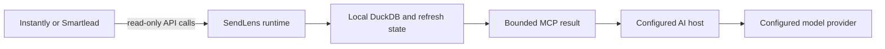

## The short version

The default SendLens path runs locally over `stdio`. Provider keys, the DuckDB cache, raw campaign evidence, and fetched reply bodies stay on the machine running the AI host unless the operator chooses a different runtime.

SendLens is read-only with respect to outbound providers.

## Data flow

The final hop is controlled by the AI host and model provider, not by this repository. Tool results become part of the host conversation just like other content provided to that host.

## Local storage

The default DuckDB cache can hold:

- campaign and aggregate provider evidence
- sender accounts, assignments, and health
- steps, variants, tags, and placement evidence
- bounded lead samples and custom provider fields
- locally reconstructed outbound copy
- fetched inbound reply bodies when deep analysis requests them
- coverage and refresh metadata

The cache also stores a one-way fingerprint of the provider key so a newly configured key cannot silently read a previous workspace cache. It does not store the raw key.

## What can leave the machine

Data can leave through expected operator-controlled paths:

- calls from SendLens to the configured outbound provider
- MCP results returned to the configured AI host
- model-provider calls made by that host
- installer and package-manager downloads
- any separate integration the operator invokes

<Warning>
  “Local-first” does not mean an AI host never sends tool output to a model provider. Review the data handling of the host and model you choose.
</Warning>

## Optional HTTP and container use

The optional Streamable HTTP mode exposes the same read-only tools from the machine or single-tenant container running SendLens. The cache stays with that runtime, while results travel to the connected MCP client. Public use requires HTTPS termination and deployment controls outside SendLens.

The health route reports only static health, version, and transport information. It does not expose provider or workspace data.

## Future commercial boundary

These docs do not claim that a hosted paid-product service exists today. Any future service boundary must remain separate from provider evidence and is gated by the decisions and proof listed on [Activation status](/docs/get-started/activation-status).
